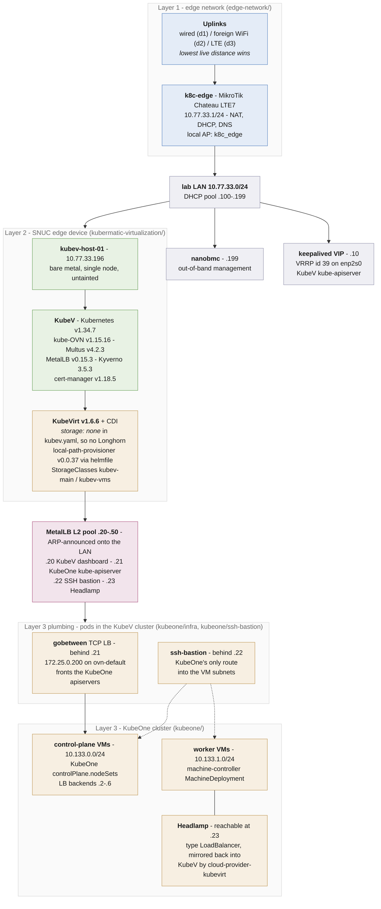

# KubeV Edge Setup

A complete, self-contained virtualization stack that fits in a bag: a router that
finds its own internet, a single mini-PC running Kubermatic Virtualization
(KubeV), and a KubeOne Kubernetes cluster whose nodes are KubeVirt VMs on top of
it.

Three layers, each independently usable, each in its own directory:

| Layer | Directory | What it gives you |
|-------|-----------|-------------------|
| 1. Edge network    | [`edge-network/`](edge-network/)                           | MikroTik Chateau LTE7. A stable `10.77.33.0/24` lab LAN regardless of whether the internet arrives by cable, foreign WiFi or LTE. |
| 2. KubeV on a SNUC | [`kubermatic-virtualization/`](kubermatic-virtualization/) | Kubermatic Virtualization on the mini-PC: Kubernetes, KubeOVN, KubeVirt, MetalLB, storage. The thing that runs VMs. |
| 3. KubeOne cluster | [`kubeone/`](kubeone/)                               | A second, fully independent Kubernetes cluster whose control plane and workers are KubeVirt VMs running on layer 2. |

The point of stacking them is that layer 3 is a *customer-shaped* cluster. It is
provisioned by KubeOne exactly as it would be against vSphere or AWS, except the
machines underneath are VMs on a box you can carry.

## Architecture



## Addressing

The lab LAN, as observed live on the router (`just leases` in `edge-network/`):

| Address        | Name            | What it is                                        |
|----------------|-----------------|---------------------------------------------------|
| `10.77.33.1`   | `k8c-edge`      | Chateau: gateway, DHCP server, DNS cache          |
| `10.77.33.10`  | -               | keepalived VIP, kube-apiserver of the KubeV cluster |
| `10.77.33.196` | `kubev-host-01` | the SNUC, KubeV control-plane node                |
| `10.77.33.198` | `yanblack`      | laptop (DHCP)                                     |
| `10.77.33.199` | `nanobmc`       | the SNUC's BMC, out-of-band management            |

DHCP hands out `.100-.199`. The VIP at `.10` sits deliberately outside the pool.

Inside the KubeV cluster the networks are separate again: pod CIDR
`172.25.0.0/24` (kube-ovn default VPC), MetalLB pool and API endpoint as
configured in `kubermatic-virtualization/kubev/kubev.yaml`.

## Build order

Each layer depends on the one below it, so build bottom-up.

### 1. Edge network

```bash
cd edge-network
cp .env.example .env     # fill in host, SSH key, venue WiFi credentials
just config              # check what it resolved
just apply               # import the config onto the router
just uplinks             # which uplink is carrying traffic
```

The router is the only layer that must work before anything else: it is the DHCP
server and DNS resolver for the SNUC. Full details, web-UI locations and the
failover design are in [`edge-network/README.md`](edge-network/README.md).

### 2. KubeV on the SNUC

```bash
cd kubermatic-virtualization
just local-kubev-tooling-start   # tooling container with the kubermatic-virtualization CLI
just env-prepare                 # ssh-agent + deployment key
just kubev-lb-tf-init            # keepalived VIP via Terraform
just kubev-lb-tf-apply
just kubev-apply                 # kubermatic-virtualization apply, kubeconfig, untaint, helmfile
```

`just kubev-apply` also untaints the control-plane nodes, which matters on a
single-node edge box: without it nothing schedulable lands anywhere. Storage is
not part of the KubeV config (`storage: none: {}`), so no Longhorn - it is
layered on afterwards by `kubev/helmfile.yaml`, which installs
local-path-provisioner v0.0.37 and then applies the `kubev-main` / `kubev-vms`
StorageClasses, the CDI config and the StorageProfile pins. Rook Ceph and
Portworx manifests sit under `kubev/storage/` but are not deployed; on one node
with no spare block device, local-path is what works. See
[`kubermatic-virtualization/README.md`](kubermatic-virtualization/README.md).

### 3. KubeOne cluster on KubeVirt VMs

```bash
cd kubeone
just preflight     # tools, kubeconfig, ssh-agent, bastion reachability
just up            # infra -> kubeone apply -> kubeconfig -> nodes
```

KubeOne 1.14 provisions the control-plane VMs itself through
`controlPlane.nodeSets`, so there are no VM manifests to maintain. Roughly 8-12
minutes, most of it CDI importing the Ubuntu image. See
[`kubeone/README.md`](kubeone/README.md) for the gobetween load balancer, why
its backend list is hard-coded, and the `v1beta2` apiVersion trap.

## LoadBalancer addressing

Two ways for a Service in the KubeV cluster to get an address that works from
the lab LAN. Both are configured; they use separate prefixes so they never
compete for the same IP.

| Mode | Pool | How the LAN finds it | Configured in |
|------|------|----------------------|---------------|
| **L2** (default)  | `10.77.33.20-50` - inside the LAN | the speaker answers ARP on the LAN | `kubev/kubev.yaml` -> `loadBalancer.metallb.ipRange` |
| **BGP** (opt-in)  | `10.77.34.0/24` - routed          | the Chateau learns a /32 per Service and routes it to the node | `kubev/metallb-bgp/` + `edge-network/` `just bgp-apply` |

BGP is the more interesting one for a demo: the router genuinely learns routes
from the cluster, and `just bgp-routes` on the Chateau shows Services appearing
and disappearing as you create and delete them.

```bash
# router side - eBGP AS64512 <-> AS64513, accepts only the pool
cd edge-network      && just bgp-apply

# cluster side - pool, peer, advertisement
cd kubermatic-virtualization && kubectl apply -f kubev/metallb-bgp/

# prove it
kubectl apply -f kubermatic-virtualization/kubev/metallb-bgp/99-demo-service.yaml
cd edge-network && just bgp-routes
```

Three design points worth keeping:

- **The pool is outside the LAN on purpose.** If it sat inside `10.77.33.0/24`
  the router would have both a connected route and a BGP route for the same
  address, and a dropped session would silently blackhole instead of failing
  over. A separate prefix keeps the two modes independent.
- **The router-id is pinned to `10.77.33.1`.** RouterOS defaults to a *dynamic*
  router-id that follows the active uplink - on this box it resolves to the LTE
  address. Without the pin, every uplink failover would reset the BGP session.
- **The router only accepts the pool.** A `metallb-in` routing filter rejects
  everything else, so a misconfigured or compromised cluster cannot inject a
  default route into the lab.

The pool is `autoAssign: false`, so existing Services keep using the L2 pool.
Opt in per Service with `metallb.io/address-pool: bgp-pool`.

## Current state

Layers 1 and 2 are live on the edge LAN and agree with each other: `kubev.yaml`
and `terraform.tfvars` both describe the single SNUC at `10.77.33.196` with the
VIP at `10.77.33.10`, both over SSH as `ubuntu`.

Layer 3 is fully retargeted onto the edge. Both things that used to point at
the datacenter now sit on the lab LAN, which is why no route into
`172.25.0.0/24` is needed from a laptop any more:

| What | Where it points now |
|------------------|------------------------------------------------------------|
| `apiEndpoint.host` | `10.77.33.21`, the MetalLB Service in front of gobetween. `172.25.0.200` stays in `alternativeNames`, so the two are swappable without a new certificate. |
| `ssh.bastion`      | `10.77.33.22`, the in-cluster `ssh-bastion` pod, also a MetalLB Service. It is what gives KubeOne a route into `10.133.0.0/24`. |

The cluster itself has not been provisioned on this box yet - `just up` in
`kubeone/` is the next step.

## Gotchas that cost time

- **A Tailscale exit node swallows the lab LAN.** With an exit node active and
  *Allow Local Network Access* off, `10.77.33.0/24` gets routed into the tunnel
  and every device on the wire goes dark. `route -n get 10.77.33.196` naming
  `utun4` instead of your ethernet interface is the tell.
- **VM disks need a storage class that can serve a raw block device.** Longhorn
  as a default class cannot, and the CDI import then hangs forever with no error.
- **KubeOne rejects `apiVersion: kubeone.k8c.io/v1beta3`** even though the
  upstream docs use it. Use `v1beta2`; the types are identical.
- **The router is the DNS server for everything on the LAN.** If the SNUC cannot
  resolve, check the router's uplink before suspecting the cluster.
