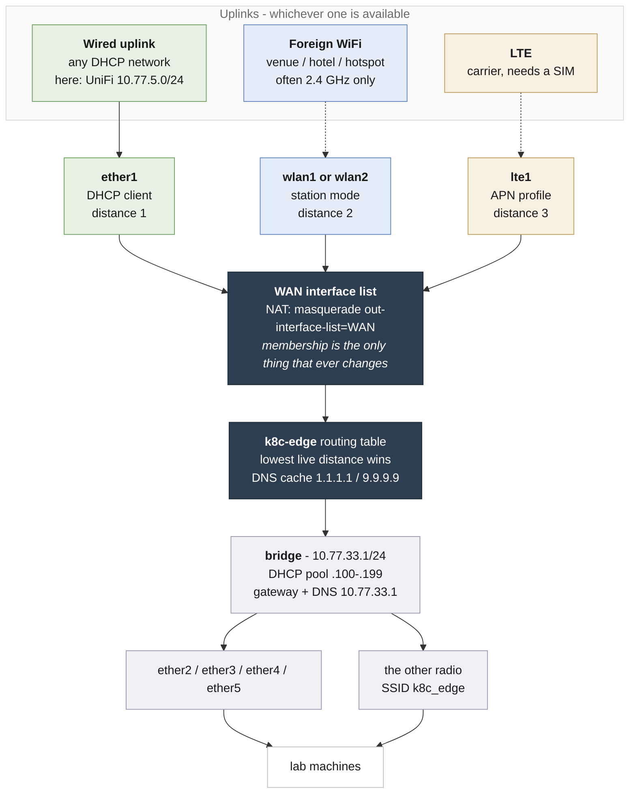
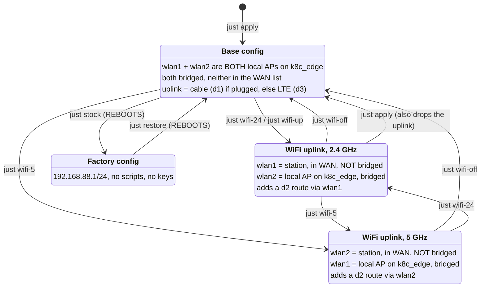

# k8c-edge - MikroTik Chateau LTE7 mobile lab

Portable lab router. Machines hang off a private LAN that never changes, while
the internet behind it can come from a wired uplink, a foreign WiFi, or the LTE
modem - whichever is available, without reconfiguring anything.

| | |
|-----------|----------------------------------------------------------|
| Model     | `D53G-5HacD2HnD-TC&R11e-LTE7` (Chateau LTE7)              |
| RouterOS  | 7.20.4 stable, L4                                        |
| Radios    | wlan1 2.4 GHz b/g/n, wlan2 5 GHz a/n/ac                   |
| Package   | legacy `wireless` (`/interface/wireless`), not wifi-qcom-ac |
| Modem     | R11l-LTE7, Cat6                                          |
| Identity  | `k8c-edge`                                               |

## Architecture



Lowest distance wins, so a wired uplink beats WiFi beats LTE. Unplug the wire
and its route disappears within a second or two, LTE takes over; plug it back
and the wire wins again. Nothing to click.

NAT is the stock `masquerade out-interface-list=WAN` rule and was never edited -
adding an uplink to the `WAN` interface list is the only thing that ever
changes.

> Failover is **link-based, not internet-based**. A cable that is plugged in but
> has no internet behind it still wins. Fixing that needs per-WAN probe routes
> (recursive routing or netwatch); not configured here.

## Ports

| RouterOS          | Role                                            |
|-------------------|-------------------------------------------------|
| `ether1`          | WAN uplink - the only port outside the bridge   |
| `ether2`-`ether5` | LAN, bridged                                    |

**Do not trust the silkscreen numbering to line up with these names.** Identify
a port empirically instead: plug a machine in, then look for its MAC.

```sh
just ros '/interface/bridge/host/print where !local'
#  00:00:01:05:27:D6  ether4   <- nanobmc  (the SNUC's BMC)
#  00:00:01:03:0B:10  ether5   <- kubev-host-01
```

`just ros ':foreach e in=[/interface/ethernet/find] do={:put ([/interface/ethernet/get $e name]." running=".[/interface/get [/interface/find name=[/interface/ethernet/get $e name]] running])}'`
shows which ports have link at all, which is the quickest way to find the one
your cable is in.

## What was changed

Everything else is stock `defconf`. Base was a factory-reset RouterOS 7.20.4.

| # | Setting                | From                    | To                                     | Why |
|---|------------------------|-------------------------|----------------------------------------|-----|
| 1 | Identity               | `MikroTik`              | `k8c-edge`                             | tells it apart from any other MikroTik on site |
| 2 | NTP client             | disabled                | `de.pool.ntp.org`, `pool.ntp.org`      | clock was 10 months stale, which breaks TLS and logs |
| 3 | Time zone              | `manual +00:00`         | `Europe/Berlin`                        | readable log timestamps |
| 4 | DNS servers            | empty                   | `1.1.1.1`, `9.9.9.9`                   | resolution survives an uplink switch; all WAN clients run `use-peer-dns=no` |
| 5 | `ether1` bridge port   | member of `bridge`      | removed                                | it becomes the WAN port; while bridged it passed the venue DHCP straight through |
| 6 | DHCP client            | none                    | on `ether1`, distance 1, `WAN-wired`   | wired uplink |
| 7 | `WAN` interface list   | `lte1`                  | `lte1` + `ether1` (+ the uplink radio while a WiFi uplink is active) | drives the stock NAT rule |
| 8 | LTE APN `default`      | distance 2, peer DNS on | distance 3, `use-peer-dns=no`          | LTE is the last resort, and DNS stays fixed |
| 9 | Security profile       | none                    | `wifi-uplink` added                    | credentials for a foreign network, kept apart from the local AP profile |
| 10| LAN address            | `192.168.88.1/24`       | `10.77.33.1/24`                        | `192.168.x` collides with nearly every venue network |
| 11| DHCP pool              | `192.168.88.10-254`     | `10.77.33.100-199`                     | follows the LAN change, leaves `.2-.99` for static assignment |
| 12| DHCP network           | `192.168.88.0/24`       | `10.77.33.0/24`, gw + DNS `10.77.33.1` | follows the LAN change |
| 13| Scripts                | stock `defconf` only    | 6 added (see below)                    | workspace + uplink switching |
| 14| SSH keys               | none                    | 3 admin keys: `claude-chateau`, `claude-chateau-ed`, `tobi@loodse.com` | remote administration; drop the `claude-*` pair when you no longer want it |
| 15| `default-authentication` | `no` on both radios    | `yes` on both radios                   | `no` + an empty access-list rejects every client in AP mode and joins nothing in station mode |
| 16| Local AP key            | whatever was on the box | set from `CHATEAU_LAN_AP_PSK`          | without it a rebuild leaves `k8c_edge` **open** |
| 17| LTE roaming             | `allow-roaming=no`      | `allow-roaming=yes`                    | the factory default refuses to attach outside the home network - silently |

Untouched on purpose: the whole firewall filter chain, the NAT rule, the
`LAN` interface list, the radios' SSID `k8c_edge`, and the DHCP server itself.
The stock `defconf` scripts (`dark-mode`) are left in place too.

`wifi-uplink` deliberately accepts `wpa-psk,wpa2-psk` and `tkip,aes-ccm` -
wider than the local AP, because venue networks are often older than what you
would run at home.

## Where to find it in the Web UI

WinBox and WebFig (port 80, `http://10.77.33.1`) share the same menu tree.

| What                        | Menu path                                              |
|-----------------------------|--------------------------------------------------------|
| Identity                    | System > Identity                                      |
| NTP servers                 | System > NTP Client                                    |
| Time zone                   | System > Clock > Time tab                              |
| DNS servers + cache         | IP > DNS                                               |
| LAN address `10.77.33.1/24` | IP > Addresses                                         |
| WAN DHCP client             | IP > DHCP Client                                       |
| DHCP pool                   | IP > Pool                                              |
| DHCP server + its network   | IP > DHCP Server, **Networks** tab for gateway and DNS  |
| Active leases               | IP > DHCP Server > **Leases** tab                      |
| Bridge membership           | Bridge > **Ports** tab                                 |
| `WAN` / `LAN` lists         | Interfaces > **Interface List** button                 |
| NAT rule                    | IP > Firewall > **NAT** tab                            |
| Firewall rules              | IP > Firewall > **Filter Rules** tab                   |
| LTE interface + signal      | Interfaces > **LTE** tab > double-click `lte1`         |
| LTE APN profiles            | Interfaces > **LTE** tab > **APN** button              |
| WiFi uplink credentials     | Wireless > **Security Profiles** tab > `wifi-uplink`   |
| Radio mode, SSID, scanning  | Wireless > **WiFi Interfaces** tab > double-click radio |
| The switching scripts       | System > **Scripts** (select, then **Run Script**)     |
| Backups and exports         | **Files**                                              |
| Admin SSH keys              | System > Users > **SSH Keys** tab                      |
| Routing table + distances   | IP > Routes                                            |

> **Never use Quick Set on this router.** It rewrites the whole config from a
> template and would flatten the bridge layout, the `WAN` list and the uplink
> priorities. If it happens, `/system/script/run ws-k8c-edge` restores
> everything.

## Files

| File                  | Purpose                                                       |
|-----------------------|---------------------------------------------------------------|
| `.env.example`        | every parameter, documented. Copy to `.env` and edit           |
| `.env`                 | your local values. **Gitignored** - may hold a venue PSK      |
| `k8c-edge.rsc.tmpl`   | the config, with `__TOKEN__` placeholders                      |
| `workspaces.rsc`      | the switching scripts below                                   |
| `bgp-metallb.rsc.tmpl`| optional: eBGP peering with the KubeV cluster's MetalLB       |
| `k8c-edge.export.rsc` | full `/export` of the running config, identity + uplink SSID redacted |
| `Justfile`            | every router action as a `just` recipe - the easy way to drive this |

Nothing device-specific is hardcoded. `just render` substitutes `.env` into the
template and fails loudly if any placeholder is left over; `just apply` renders
and imports in one step. Change a value in `.env`, run `just apply`, and the
running config follows.

`*.backup` is gitignored on purpose: RouterOS binary backups embed the WiFi
PSK, SSH keys and user password hashes. They live on the router (and in your
password manager), never in this repo.

## Configuration

All parameters live in `.env`. Start from the template:

```sh
cp .env.example .env      # then edit
just config               # show what .env actually resolved to
```

`.env` is gitignored because it holds the path to your SSH key and, optionally,
a venue's WiFi password. `.env.example` is the committed, secret-free version -
keep the two in sync when you add a parameter.

```sh
CHATEAU_HOST=10.77.33.1                 # where the router is
CHATEAU_KEY=/absolute/path/to/key       # empty = password auth, ssh prompts
CHATEAU_LAN_IP=10.77.33.1               # the lab LAN
CHATEAU_POOL=10.77.33.100-10.77.33.199
CHATEAU_WAN_IF=ether1                   # the uplink port
CHATEAU_RADIO_24=wlan1                  # 2.4 GHz radio
CHATEAU_RADIO_5=wlan2                   # 5 GHz radio
CHATEAU_DIST_WIRED=1                    # route priorities:
CHATEAU_DIST_WIFI=2                     #   lowest live distance wins
CHATEAU_DIST_LTE=3
CHATEAU_LAN_AP_PSK=<the lab AP key>     # EMPTY = leave the router as-is
CHATEAU_LTE_ROAMING=yes                 # attach to foreign carriers (needed abroad)
CHATEAU_BGP_POOL=10.77.34.0/24          # optional: MetalLB pool learned over BGP
WIFI_SSID=                              # optional: lets `just wifi-up` run bare
WIFI_PASS=                              #   leave empty to be prompted instead
```

`CHATEAU_LAN_AP_PSK` empty means `just apply` leaves the existing security
profile alone rather than opening the AP - which is what you want in
`.env.example`, and not what you want when building a router from scratch.

See `.env.example` for the full annotated set.

## Driving it with `just`

Everything below can be done by hand over SSH or WinBox, but the `Justfile`
wraps it. `just --list` for the full set.

```sh
just config                      # what .env resolved to
just status                      # identity, uplinks, addresses, radios
just uplinks                     # default routes and which one is carrying traffic

just scan 2.4                    # what is on the air, with signal and encryption
just wifi-up                     # join the uplink named in .env, no arguments
just wifi-24 '<SSID>'            # or name one explicitly, prompts for the PSK
just wifi-off                    # both radios back to local APs

just render                      # .env + template -> k8c-edge.rendered.rsc
just apply                       # render, then import it on the router
just test-failover               # pull the wired uplink, prove the backup works, restore
just save                        # snapshot the workspace on the router

just lte-status                  # SIM, PIN, registration, band and signal
just lte-reset                   # power-cycle the modem (needed after inserting a SIM)
just lte-unlock                  # re-apply the SIM PIN if it has re-locked

just leases                      # who has a DHCP lease on the lab LAN
just log 50                      # recent router log
just fetch-config                # pull the running config into k8c-edge.export.rsc
just push-scripts                # upload + import the switching scripts
just restore                     # back to the k8c-edge workspace  (REBOOTS)
just stock                       # back to the factory config      (REBOOTS)

just bgp-apply                   # optional: peer with the KubeV cluster's MetalLB
just bgp-status                  # session state and learned prefixes
just bgp-routes                  # which service addresses the cluster announces
just bgp-remove                  # tear the peering down again

just ros '/ip/route/print'       # any RouterOS command
just shell                       # interactive RouterOS terminal
```

`just wifi-24 SSID` with no password argument **prompts** for it, so the PSK
never lands in shell history. Set `WIFI_PASS` in `.env` only if you would
rather have `just wifi-up` run unattended - and clear it when you leave.

> `just apply` restores the base config, which puts **both radios back to
> being local APs**. If a WiFi uplink is active it will be dropped - re-join
> with `just wifi-up` afterwards.

## Switching

Two independent things decide where traffic goes, and mixing them up is the
usual source of confusion:

1. **Which radio is the uplink** - a real mode, changed only by the commands
   below.
2. **Which uplink actually carries traffic** - never a command. Whichever live
   default route has the lowest distance wins, automatically: wired 1, WiFi 2,
   LTE 3.

So `just wifi-24` does not "switch to WiFi"; it puts `wlan1` into station mode
and adds a distance-2 route. If a cable is plugged in, the cable still wins.



### Which command does what

| Command | Underlying script | Effect on the mode |
|---------|-------------------|--------------------|
| `just wifi-24 '<SSID>'` | `wan-wifi24-on` | `wlan1` -> station on that SSID; `wlan2` forced to local AP |
| `just wifi-5 '<SSID>'`  | `wan-wifi5-on`  | `wlan2` -> station on that SSID; `wlan1` forced to local AP |
| `just wifi-up`          | either          | same, using `WIFI_SSID` / `WIFI_BAND` from `.env` |
| `just wifi-off`         | `wan-wifi-off`  | both radios back to local APs on `k8c_edge`, WiFi route removed |
| `just apply`            | -               | re-imports the base config. **Also drops any WiFi uplink** |
| `just save`             | `ws-save`       | snapshots the running config as the `k8c-edge` workspace |
| `just restore`          | `ws-k8c-edge`   | restores that workspace. **Reboots** |
| `just stock`            | `ws-stock`      | back to the factory config. **Reboots** |

Nothing here changes the LTE or wired uplinks - they are always present and
simply win or lose on distance. To test one in isolation, remove the others:
unplug the cable and `just wifi-off` leaves LTE carrying everything.

`/system/script/run` takes **a script name and nothing else**. It has no
arguments - `run wan-wifi24-on ssid=... profile=...` is a syntax error. The
SSID and password are set afterwards, as two separate commands.

**Which band?** Guest and venue networks are very often 2.4 GHz only, so
`wan-wifi24-on` is usually the one you want. Scan before deciding:

```
just scan 2.4
just scan 5
```

Whichever radio becomes the uplink, the other one is forced back to being the
local AP on `k8c_edge`, so the lab never loses its own network. A radio cannot
be a useful AP and a station at the same time, which is why this is a swap
rather than an addition.

### Password and network name live in two different places

This trips everyone up on RouterOS: the **security profile holds only the
password and encryption - it has no SSID field**. The network name is a property
of the *interface*.

| What         | Where it lives                 | WinBox                                                        |
|--------------|--------------------------------|---------------------------------------------------------------|
| Password     | security profile `wifi-uplink` | Wireless > **Security Profiles** > `wifi-uplink`               |
| Network name | the uplink interface           | Wireless > **WiFi Interfaces** > `wlan1` or `wlan2` > **SSID** |

The same `ssid` field on a radio means different things depending on mode: in
`ap-bridge` it is the name the radio **broadcasts**, in `station` it is the
network the radio **joins**. `wan-wifi-off` therefore resets both radios to `k8c_edge`,
so a local AP can never end up broadcasting a venue's network name after a
trip.

**CLI:**

```
/system/script/run wan-wifi24-on
/interface/wireless/security-profiles/set wifi-uplink wpa2-pre-shared-key="THEIR-PASSWORD"
/interface/wireless/set wlan1 ssid="THEIR-SSID"
/interface/wireless/monitor wlan1 once        # want: status: connected-to-ess
```

**WinBox / WebFig**, which is easier at a venue because you can scan instead of
typing an SSID:

1. `/system/script/run wan-wifi24-on` (or `wan-wifi5-on`) first - this does the
   plumbing the UI will not: radio out of the bridge, into station mode, DHCP
   client at distance 2, into the `WAN` list, and the other radio forced back
   to being the local AP.
2. Wireless > **Security Profiles** tab > double-click `wifi-uplink` >
   fill **WPA2 Pre-Shared Key** (and WPA Pre-Shared Key for older networks) > OK.
3. Wireless > **WiFi Interfaces** tab > double-click the uplink radio >
   **Scan...** > select the network > **Connect**. This writes the SSID onto
   the interface for you, along with band and frequency - which is why scanning
   beats typing an SSID by hand at a venue.

## Verified state (2026-09-17)

Built and tested against the live unit, RouterOS 7.20.4.

| Check | Result |
|-------|--------|
| WAN lease from UniFi on `ether1` | `10.77.5.95/24` via `10.77.5.1`, distance 1 |
| Router to internet | 3/3 ping, 4ms |
| Router DNS | resolves via `1.1.1.1` |
| NTP | `synchronized`, stratum 2, offset 1.7ms |
| LAN | `10.77.33.1/24`, pool `.100-.199` |
| Client through the router | 3/3 ping 5ms, DNS ok, HTTP 301 |
| NAT | stock `masquerade out-interface-list=WAN`, never modified |
| `wan-wifi-on` / `wan-wifi-off` | round-tripped: mode, bridge membership, WAN list and DHCP client all flip and revert cleanly; 5 GHz AP returns to `running-ap` |
| SSID round-trip | joined a simulated venue SSID in station mode, toggled back, `wlan2` correctly returned to `ap-bridge` on `k8c_edge` |
| `ws-save` | run, writes `k8c-edge.backup` + `k8c-edge.rsc` |
| **WiFi uplink, real network** | joined a live 2.4 GHz WPA2 network via `wan-wifi24-on`: `connected-to-ess`, DHCP lease obtained, 144 Mbps tx / 130 Mbps rx at -54 dBm |
| **Failover wired -> WiFi** | disabled `ether1` -> traffic moved to the WiFi uplink, ping 7ms and DNS still resolving; re-enabled -> wired took over again at distance 1 |
| **Failover WiFi -> LTE** | disabled `wlan1` -> active route flipped to `lte1` at distance 3, ping 27ms, `github.com` resolved; re-enabled -> WiFi took distance 2 back and LTE returned to standby |
| **LTE, real SIM** | Telekom.de, `registered`, band B3 @ 20 MHz, RSSI -61dBm, address `10.216.188.149/32`, default route at distance 3 |
| **LTE roaming** | enabled (`allow-roaming=yes`); modem re-initialised and re-registered in under 15s, back on Telekom.de band B20 at -59dBm |
| **LTE as sole uplink** | `just wifi-off` with no cable: LTE carried everything. 20/20 ping 1.1.1.1 (min 14.4 / avg 22.0 / max 36.8 ms, 0% loss), DNS ok, 10 MB in 2.07 s = 4.82 MB/s (~38.6 Mbit/s), band B3 @ 20 MHz, RSSI -70 dBm, SINR 5 dB, public IP 80.187.82.151 |
| `just` recipes | `config`, `status`, `uplinks`, `wifi-status`, `lte-status`, `leases`, `scan 2.4`, `scan 5`, `wifi-off`, `wifi-24`, `test-internet` all run against the live unit |
| Local AP accepts clients | `default-authentication=yes` on both radios, verified `running-ap` with a bridged `wlan2` |
| **Client on `k8c_edge`** | a laptop associated on `wlan2` at -42 dBm, 866.6 Mbps (80 MHz / 2 streams) and took DHCP lease `10.77.33.195`; it uses a private Wi-Fi address, so it shows no hostname |
| `.env` externalisation | `just config` resolves from `.env`; `just render` substitutes every placeholder with none left over; `just apply` imported cleanly; `just wifi-up` joined a real network with no arguments |

All three uplinks and both failover hops are now exercised end to end.
The `wifi-uplink` profile currently holds the PSK of the last network joined.
It is a working credential, not a placeholder - treat the router as holding a
secret and use `ws-stock` before handing it to anyone.

## Gotchas

- **macOS service order.** If `USB 10/100/1000 LAN` sits above `Wi-Fi` in
  System Settings > Network > Set Service Order, the Mac routes *everything*
  through this router the moment the cable has link and an address. Plug the
  uplink into port 1 *before* plugging the Mac into port 2, or the Mac inherits
  a LAN with no internet and local DNS dies.
- **Management path that always works.** IPv6 link-local survives any subnet
  change because it is L2-based:
  `ssh admin@fe80::6f4:1cff:fef7:284c%<iface>`
- **Carrier CGNAT** means no inbound on LTE. Use a tunnel out (WireGuard is
  built into RouterOS 7) if the lab has to be reachable.
- **Double NAT** behind the venue router is intentional and is what makes the
  lab a separate network. Side effect: no mDNS/Bonjour between lab and home,
  and nothing upstream can reach the lab without a route plus a forward rule.
- **Roaming is OFF in the factory config.** `allow-roaming=no` on `lte1` means
  the modem will not attach to any network but the SIM's home carrier - exactly
  the situation a travelling lab is built for, and it fails silently: the modem
  simply never registers. `CHATEAU_LTE_ROAMING` in `.env` drives it, and the
  config template sets it, so `just apply` no longer reverts it. Changing the
  value **re-initialises the modem** (`status: radio off` for ~15 seconds) and
  the LTE address changes. Within the EU a German SIM roams at domestic rates;
  elsewhere check the tariff first.
- **`/tool/fetch` is blocked by device-mode.** RouterOS 7.13+ gates a set of
  features behind `device-mode`, and lifting it needs physical confirmation at
  the box. So no throughput test from the router itself - measure from a LAN
  client instead, binding to the interface that faces the router
  (`curl --interface en7 ...` on macOS) so a VPN or exit node cannot silently
  carry the traffic somewhere else.
- **A SIM PIN does not survive a modem re-init.** RouterOS 7.20 unlocks the SIM
  once and never writes the PIN to the config (`/interface/lte/export
  show-sensitive` shows no `pin=`), so every modem restart leaves the router at
  `pin-status: waiting for primary PIN` with no LTE. The fix used here was to
  **remove the PIN from the SIM** in a phone - a router that boots unattended in
  a venue cannot be asked for one. `CHATEAU_SIM_PIN` + `just lte-unlock` remain
  for a SIM you cannot change.
- **The modem only scans for a SIM at startup.** Inserting one into a running
  router reads as `SIM not inserted` no matter how long you wait. Power-cycle
  the modem (`just lte-reset`) to make it rescan.
- **`default-authentication=no` breaks BOTH modes, in different ways.** The
  factory config ships both radios with it set to `no`, and the access-list and
  connect-list are empty. That single setting means:
  - in **station** mode: join nothing. The radio sits at
    `status: searching-for-network` forever with a strong signal and the right
    PSK, and **not one line in the log** says why.
  - in **AP** mode: reject every client. macOS reports this as
    *"Unable to join the network. If your network access is managed by Wi-Fi
    address ... turn off Temporary Wi-Fi Address"* - a red herring: private MAC
    addresses are not the problem, the empty access-list is. Android and Windows
    just say "authentication error".

  Everything here sets it to `yes` on both radios in both modes. If you ever
  restore a factory backup, set it again.
- **A wrong PSK and a wrong band look identical** from `monitor`: both sit at
  `searching-for-network`. `just scan 2.4` / `just scan 5` tells them apart -
  if the SSID is not in the list for that band, the radio physically cannot
  join it.
- **`/system/script/run` takes no arguments.** `run wan-wifi24-on ssid=...` is
  a syntax error; SSID and PSK are separate commands afterwards.
- **RouterOS over `ssh host 'cmd'`** parses per line - multi-line `:if ... do={ }`
  blocks break. Use one-liners, or `/import` a file.

## Recovering from a lockout

Never bounce the port you are connected through - disabling it strands you,
because the re-enable has no path back. Use a delayed script instead:

```
/system/scheduler/add name=unlock interval=60s on-event={/interface/ethernet/set ether2 disabled=no}
```

If you are already locked out, any other LAN port (3, 4, 5) or the `k8c_edge`
WiFi gets you back in. ICMP to the WAN address answers even when SSH does not -
handy for telling "router is dead" apart from "firewall is doing its job".
