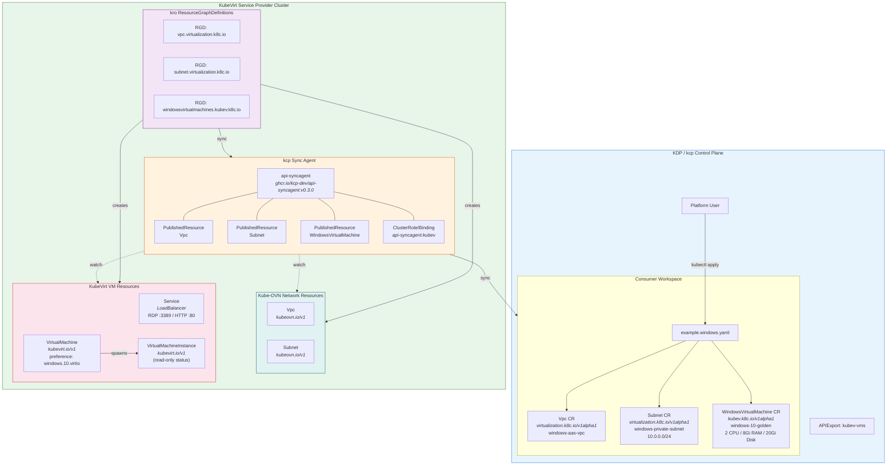

# KDP KubeVirt Service - Windows VM as a Service

This example demonstrates how to expose KubeVirt Windows VMs as a self-service offering through [Kubermatic Developer Platform (KDP)](https://docs.kubermatic.com/developer-platform/platform-users/consuming-services/).

## Architecture Overview



## How It Works

### 1. Platform User (KDP)
A platform user consumes the **kubev-vms** service via KDP and applies `example.windows.yaml`, which declares three resources:
- **Vpc** (`virtualization.k8c.io/v1alpha1`) - Virtual private network with Kube-OVN
- **Subnet** (`virtualization.k8c.io/v1alpha1`) - Private subnet (10.0.0.0/24) within the VPC
- **WindowsVirtualMachine** (`kubev.k8c.io/v1alpha1`) - Windows 10 VM (2 CPU, 8Gi RAM, 20Gi disk) using a pre-uploaded golden image

### 2. kcp Sync Agent
The [kcp API Sync Agent](https://github.com/kcp-dev/api-syncagent) bridges kcp and the service provider cluster:
- **PublishedResources** define which CRDs are exposed to kcp (Vpc, Subnet, WindowsVirtualMachine)
- Resources are synced into namespaces named `{{ .ClusterName }}-{{ .Object.metadata.namespace }}`
- RBAC grants the sync agent permissions to manage `virtualization.k8c.io` and `kubev.k8c.io` resources

### 3. Service Provider Cluster (KubeVirt)
[kro](https://kro.run) **ResourceGraphDefinitions** translate the abstract APIs into real infrastructure:

| Abstract API | RGD | Creates |
|---|---|---|
| `Vpc` (virtualization.k8c.io) | `rgd-vpc.yaml` | `Vpc` (kubeovn.io/v1) |
| `Subnet` (virtualization.k8c.io) | `rgd-subnet.yaml` | `Subnet` (kubeovn.io/v1) |
| `WindowsVirtualMachine` (kubev.k8c.io) | `rgd-vm.yaml` | `Service` (LB) + `VirtualMachine` (kubevirt.io/v1) |

The Windows VM RGD:
- Creates a **LoadBalancer Service** exposing RDP (3389) and HTTP (80)
- Creates a **KubeVirt VirtualMachine** with `preference: windows.10.virtio`, masquerade networking, and a PVC reference to the golden image (`templateImageName`)
- Reads the **VirtualMachineInstance** status to surface IP addresses, OS info, and phase back to the consumer

## Directory Structure

```
kdp-kubev/
├── architecture/          # Presentation diagram (HTML + SVG)
├── windows/               # Windows VM service
│   ├── example.windows.yaml        # Consumer example (Vpc + Subnet + WindowsVM)
│   ├── published-resource-vm.yaml  # Publishes WindowsVirtualMachine to kcp
│   └── rgd-vm.yaml                 # kro RGD: WindowsVM → Service + KubeVirt VM
├── ubuntu/                # Ubuntu VM service (separate)
│   ├── published-resource-vm.yaml  # Publishes VirtualMachine to kcp
│   └── rgd-vm.yaml                 # kro RGD: VM → KubeVirt VM + DataVolume
├── vpc-networking/        # Shared VPC/Subnet resources
│   ├── published-resource-vpc.yaml
│   ├── published-resource-subnet.yaml
│   ├── rgd-vpc.yaml
│   └── rgd-subnet.yaml
├── kcp-synagent-helm-values.yaml   # Helm values for kcp Sync Agent
├── kcp-syncagent-rbac.yaml         # RBAC for Sync Agent
└── README.md
```

## Prerequisites

The service provider cluster needs:
- [KubeVirt](https://kubevirt.io/) for VM management
- [Kube-OVN](https://kubeovn.github.io/docs/) for VPC/Subnet networking
- [kro](https://kro.run/) for ResourceGraphDefinitions
- [kcp API Sync Agent](https://github.com/kcp-dev/api-syncagent) for kcp integration
- A pre-uploaded Windows 10 golden image PVC (via packer/upload script)