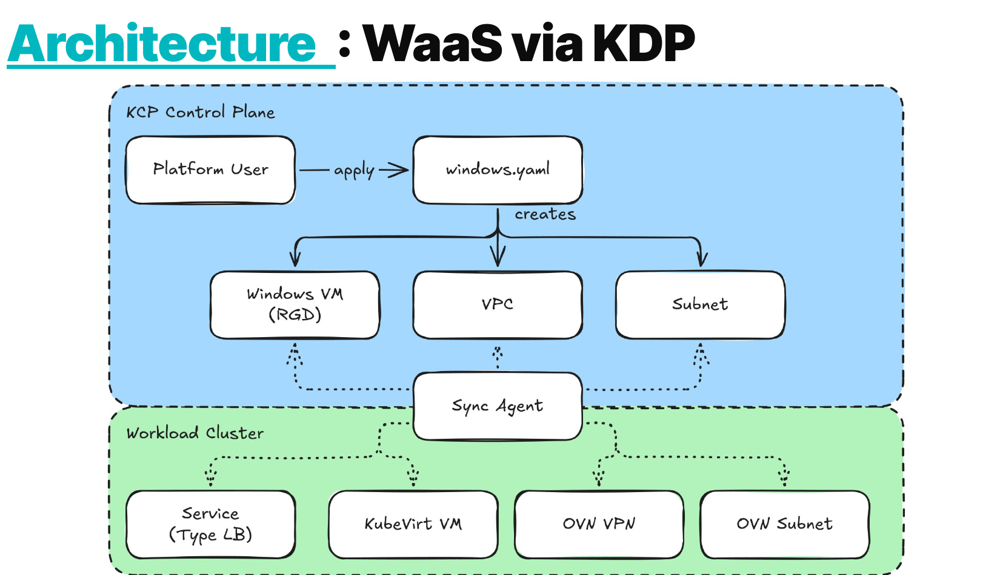

# KubeVirt VMs as a Service via KDP

Exposes KubeVirt Linux (Ubuntu, Flatcar) and Windows VMs, plus the kube-OVN networking they
sit on, as a self-service offering in the
[Kubermatic Developer Platform](https://docs.kubermatic.com/developer-platform/).

A platform user in a KDP workspace applies a `Vpc`, a `Subnet` and a VM, and gets a running
VM on an isolated tenant network. They never touch the service cluster.

## Architecture



From *Ctrl+Alt+Deploy - Windows Workload as a Service*, the Kubermatic / ODIT.Services talk
at ContainerDays Hamburg 2026
([slides](https://docs.google.com/presentation/d/1KVxBVxjd4LHKCcsntqu-kMVdfwlQv18W_0qQAiUJEmc/edit?usp=sharing)).

The user applies one YAML into a kcp workspace. The sync agent carries those objects down to
a workload cluster, where kro expands each one into the real KubeVirt and kube-OVN
infrastructure and reports status back up.

## The objects involved

```
root:tobi-org (KDP)                          kubernetes-kubev (service cluster)
-------------------                          ---------------------------------
Service kubev.k8c.io                         kro-system/       kro 0.9.3
  -> APIExport kubev.k8c.io                  kubermatic-virtualization/
  -> APIExportEndpointSlice                    api-syncagent v0.7.0
  -> Secret default/kubev.k8c.io  ----------->  secret kcp-kubeconfig
                                                PublishedResource x4
consumer namespace (e.g. dev)                cluster-scoped/  RGD x4
  Vpc / Subnet / LinuxVirtualMachine <-sync->  kubermatic-virtualization/ synced copies
                                                -> kro -> kubeovn.io Vpc + Subnet
                                                       -> kubevirt.io VirtualMachine
```

1. The KDP `Service` reserves the `kubev.k8c.io` API group and makes KDP generate an
   `APIExport`, an `APIExportEndpointSlice` and the agent kubeconfig.
2. The api-syncagent syncs objects between the workspace and the service cluster, applying
   the naming rules below.
3. kro `ResourceGraphDefinition`s turn each abstract object into real infrastructure and
   feed status back up.

## API surface

All four kinds are served under `kubev.k8c.io/v1alpha1`. Field-level detail is in
[docs/api-reference.md](docs/api-reference.md).

| Kind                    | Creates                                       |
|-------------------------|-----------------------------------------------|
| `Vpc`                   | `kubeovn.io/v1` Vpc                           |
| `Subnet`                | `kubeovn.io/v1` Subnet                        |
| `LinuxVirtualMachine`   | KubeVirt VM + DataVolume (Ubuntu or Flatcar)  |
| `WindowsVirtualMachine` | KubeVirt VM + LoadBalancer Service (RDP 3389) |

`Vpc` and `Subnet` do not create `kubeovn.io` objects directly - they go through
KubeVirtualization's own `virtualization.k8c.io` wrapper kinds, which is what gives each
tenant network a NetworkAttachmentDefinition and makes it visible in the KubeV dashboard.
The VM kinds reference a Vpc and Subnet by name, and kro blocks the whole VM until both
resolve. Both mechanisms are explained in [docs/networking.md](docs/networking.md).

## Naming and multi-tenancy

kube-OVN `Vpc` and `Subnet` are cluster-scoped, so a VPC is workspace-global rather than
per-namespace. Objects are renamed on the way down:

```
Vpc / Subnet : kdp-{{ .ClusterName }}-{{ .Object.metadata.name }}
VMs          : kdp-{{ .ClusterName }}-{{ .Object.metadata.namespace }}-{{ .Object.metadata.name }}
```

The `kdp-` prefix is not cosmetic: kube-OVN enforces `^[^0-9]` on Subnet names and kcp
cluster names often start with a digit. The cluster hash keeps these clear of the VPCs
KubeV manages itself and of the VMs already running in `kubermatic-virtualization`.

A consequence: **VPC and Subnet names must be unique within a workspace**, and a VM must
reference a VPC and Subnet from its own workspace.

Two orgs therefore cannot collide on names. They do share the service cluster's single
namespace, quota and storage - see [docs/publishing.md](docs/publishing.md).

## Deployed instance

|--------------------|-------------------------------------------------------------|
|--------------------|-------------------------------------------------------------|
| KDP                | `platform-demo`, workspace `root:tobi-org`                  |
| Service / APIGroup | `kubev.k8c.io`                                              |
| Service cluster    | `kubernetes-kubev` (demo-envs-dc-kubevirt)                  |
| Agent namespace    | `kubermatic-virtualization`                                 |
| kro namespace      | `kro-system`                                                |
| Egress external    | Subnet `vpc-egress-external` (`172.30.0.0/24`), default VPC |

## Quick start

```bash
just preflight     # check both clusters before changing anything
just deploy        # kro -> KDP Service -> agent -> RGDs -> PublishedResources -> UI
just kdp-bind      # bind the service into the workspace
just demo-linux    # apply the Linux example
just show-status   # both sides at a glance
```

Full target reference, the deploy chain and the schema-change runbook are in
[docs/operations.md](docs/operations.md).

## Documentation

| Document                                      | Covers                                                               |
|-----------------------------------------------|----------------------------------------------------------------------|
| [api-reference.md](docs/api-reference.md)     | Every field on the four kinds, and why each enum is constrained      |
| [networking.md](docs/networking.md)           | VPC/Subnet wrappers, subnet name limits, egress gateways, inbound    |
| [kdp-ui.md](docs/kdp-ui.md)                   | Dashboard forms, dropdowns, list columns, OpenAPI titles             |
| [operations.md](docs/operations.md)           | Justfile targets, deploy chain, prerequisites, schema-change runbook |
| [publishing.md](docs/publishing.md)           | Making the service available to other organizations                  |
| [troubleshooting.md](docs/troubleshooting.md) | Silent-failure modes and the accumulated gotchas                     |

Reference material and background:

| Document                                                                        | Covers                                             |
|---------------------------------------------------------------------------------|----------------------------------------------------|
| [CHANGELOG.md](CHANGELOG.md)                                                    | What changed, and when                             |
| [kubevirt-vm-vpc-subnet-selection.md](docs/kubevirt-vm-vpc-subnet-selection.md) | Attaching a plain KubeVirt VM to a kube-OVN subnet |
| [plans/](docs/plans/)                                                           | The original service design                        |
| [issues/](docs/issues/)                                                         | Upstream bug write-ups filed from this work        |

## Layout

```
Justfile                          all operations
kdp/service.yaml                  the KDP Service (reserves the API group)
kdp/public-rbac.yaml              cross-org catalog + bind grants
kdp/ui-config/                    dashboard create forms and list views
kdp/logo.png                      catalog logo artwork
kdp/logo-configmap.yaml           logo as a data URI (generated)
kdp/render-logo.sh                regenerates both from a source image
service-cluster/
  vpc-egress-external.yaml        cluster-wide external net for the egress gateways
  syncagent-values.yaml           helm values for the api-syncagent
  rbac.yaml                       agent RBAC, incl. the Role the chart forgets
  kro-rbac.yaml                   kro access to the groups these RGDs touch
vpc-networking/                   Vpc + Subnet RGDs and PublishedResources
linux/                            Linux VM RGD, PublishedResource, example
windows/                          Windows VM RGD, PublishedResource, example
*/crd-titles*.yaml                JSON Patches adding OpenAPI titles to the generated
                                  CRDs, so the dashboard shows OS / VPC / SSH Public Key
hack/                             helper scripts used by the Justfile
architecture/                     diagrams
docs/                             everything in the table above
```
