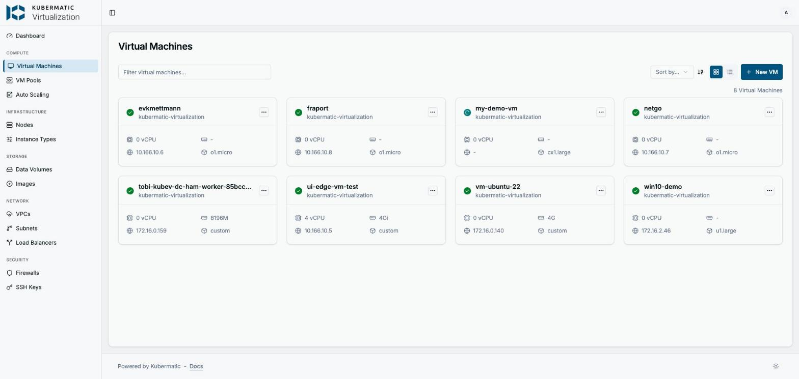
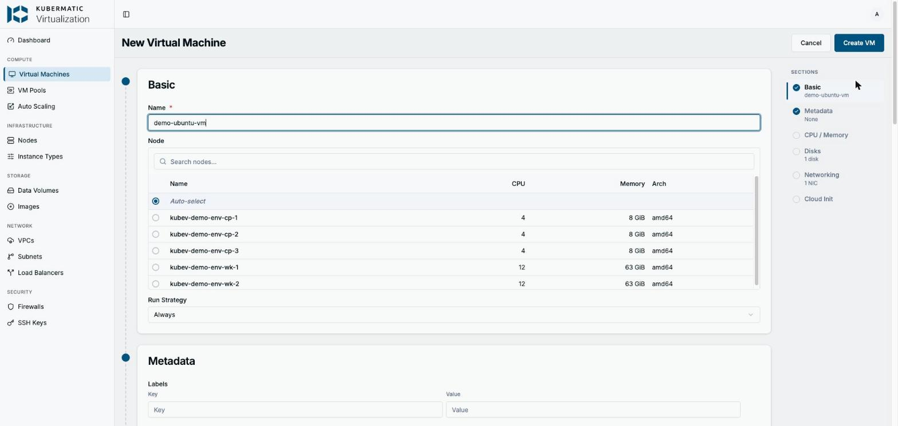
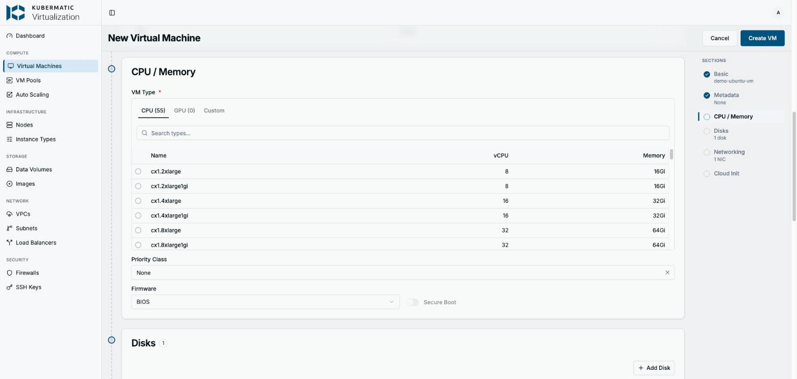
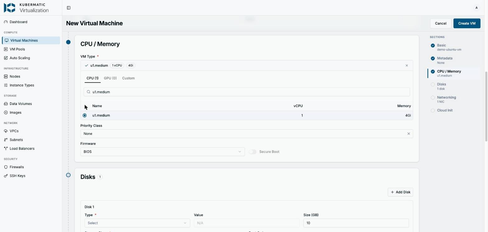
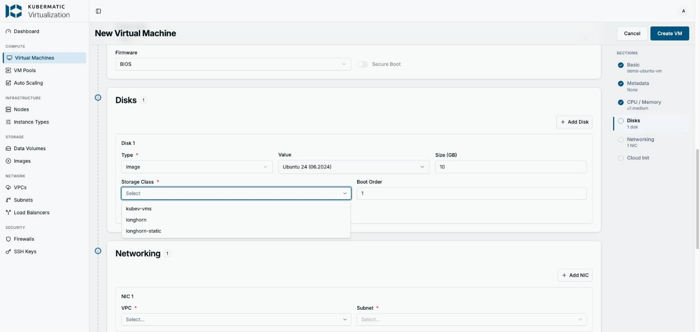
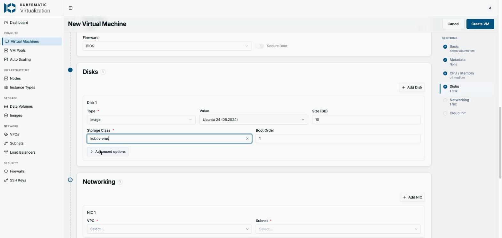
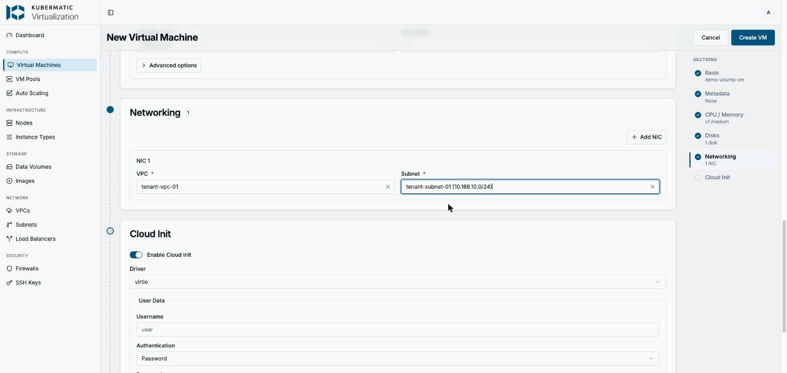
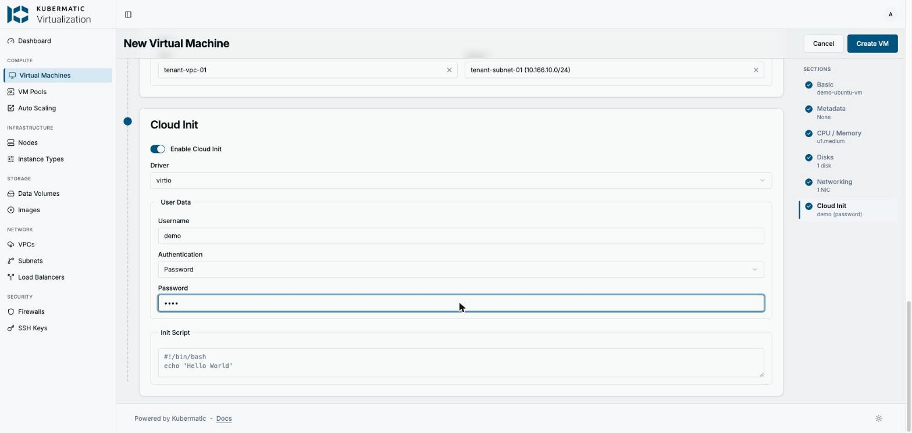
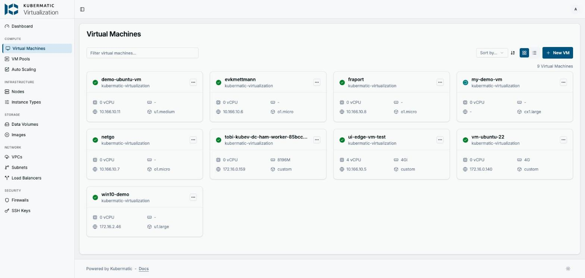

# Creating a Demo Ubuntu VM via the Kubermatic Virtualization UI

Step-by-step guide for creating a working Ubuntu demo VM through the
**Kubermatic Virtualization** dashboard at
<http://kubev.dc.k8c.io:8080/virtual-machines/create>.

The UI makes it easy to pick settings that look fine but leave the VM stuck
forever. This guide walks the whole form and calls out the two choices that
actually matter on this demo cluster.

> [!IMPORTANT]
> **The two things that break UI-created VMs on this cluster:**
>
> 1. **Instance type** — pick a **`u1.*` (Universal)** or `o1.*` type.
>    Do **not** pick `cx1.*`, `m1.*`, `n1.*` or `rt1.*`. Those need dedicated
>    CPUs (`cpumanager=true`) and/or huge pages, which the demo worker nodes
>    don't have, so the VM never schedules (`ErrorUnschedulable`).
> 2. **Storage Class** — pick **`kubev-vms`**. Do **not** pick `longhorn`;
>    VM disks need the `kubev-vms` class or the CDI image import hangs.

---

## Quick reference: which instance type can I use?

The demo worker nodes (`kubev-demo-env-wk-1/2`) are plain nodes:
`cpumanager=false` and `hugepages-2Mi = 0`. Any instance type that requires
dedicated CPU placement or huge pages can therefore never be scheduled.

| Family | Class | Dedicated CPU | Huge pages | Works on demo cluster |
| ------ | ----- | ------------- | ---------- | --------------------- |
| **`u1`**  | Universal          | no  | no    | ✅ **use this** |
| **`o1`**  | Overcommitted      | no  | no    | ✅ yes |
| `cx1` | Compute Exclusive  | yes | 2Mi   | ❌ unschedulable |
| `m1`  | Memory Intensive   | no  | 2Mi   | ❌ unschedulable (huge pages) |
| `n1`  | Network / DPDK     | yes | 1Gi   | ❌ unschedulable (+ needs DPDK nodes) |
| `rt1` | Real Time          | yes | yes   | ❌ unschedulable |

For a demo Ubuntu VM, **`u1.medium`** (1 vCPU / 4 GiB) is a good default.
Use `u1.large` (2 vCPU / 8 GiB) if you need more.

---

## Steps

### 1. Open the create form

Go to **Virtual Machines** in the left nav and click **+ New VM** (top right).



> The list already hints at the problem: `my-demo-vm` (instance type
> `cx1.large`) shows a spinning status and no IP, while every running VM uses
> `o1.micro`, `u1.large`, or a custom type.

### 2. Basic

- **Name:** `demo-ubuntu-vm`
- **Node:** leave on **Auto-select** — do not pin a node.
- **Run Strategy:** `Always`



### 3. CPU / Memory — the important one

Open the **CPU / Memory** section. The **VM Type** list is sorted
alphabetically, so `cx1.*` (Compute Exclusive) sits right at the top. **This is
the trap** — those types demand dedicated CPUs and huge pages the cluster
doesn't have.



Type `u1.medium` in the search box and select it (1 vCPU, 4 GiB). Leave
Firmware on `BIOS`.



### 4. Disks — image and storage class

In the **Disks** section, configure Disk 1:

- **Type:** `Image`
- **Value:** `Ubuntu 24 (06.2024)` (from the image picker)
- **Size (GB):** `10` (default is fine)
- **Storage Class:** **`kubev-vms`** — not `longhorn`.
- **Boot Order:** `1`





### 5. Networking

Add the NIC to the tenant network the other VMs use:

- **VPC:** `tenant-vpc-01`
- **Subnet:** `tenant-subnet-01 (10.166.10.0/24)`



### 6. Cloud Init

Leave **Enable Cloud Init** on, Driver `virtio`, and set a login:

- **Username:** `demo`
- **Authentication:** `Password`
- **Password:** `demo` (demo credential only)



### 7. Create and wait

Click **Create VM** (top right). The VM goes through:

`Provisioning` (CDI imports the Ubuntu image) → `Starting` → `Running`.

The first boot takes a couple of minutes while the image is imported into the
`kubev-vms` PVC. When it's done the card shows a green check and an IP.



> Side by side: `demo-ubuntu-vm` (`u1.medium`) is **Running** with IP
> `10.166.10.11`, while `my-demo-vm` (`cx1.large`) is still stuck with no IP.

---

## Verify from the CLI

```bash
# VM + VMI should reach Running / Ready=True
kubectl -n kubermatic-virtualization get vm,vmi -l kubevirt.io/domain=demo-ubuntu-vm

# Image import progress (should climb to 100% Succeeded)
kubectl -n kubermatic-virtualization get dv demo-ubuntu-vm-disk0

# Disk must be bound on the kubev-vms storage class
kubectl -n kubermatic-virtualization get pvc demo-ubuntu-vm-disk0
```

## Access the VM

```bash
# Serial / VNC console (login: demo / demo)
virtctl vnc demo-ubuntu-vm

# SSH (password auth, password: demo)
virtctl ssh demo@demo-ubuntu-vm
```

The dashboard also has a **Console / VNC** button on the VM detail page.
For exposing an app over HTTP, see the service/ingress helpers in the
[main README](../README.md).

---

## Troubleshooting: VM stuck in `ErrorUnschedulable`

This is what happens when you leave the instance type on a `cx1.*` (or `m1/n1/rt1`)
type. The disk imports fine, but the VM's launcher pod can never be placed.

**Symptoms**

- VM `printableStatus: ErrorUnschedulable`, VMI stuck in `Scheduling`.
- `DataVolumesReady: True` (storage is fine) but `PodScheduled: False`.
- The `virt-launcher-<vm>` pod stays `Pending` indefinitely.

**Diagnose**

```bash
kubectl -n kubermatic-virtualization get vm my-demo-vm -o jsonpath='{.status.printableStatus}{"\n"}'

# The scheduler message tells you why:
kubectl -n kubermatic-virtualization describe pod -l vm.kubevirt.io/name=my-demo-vm | grep -A3 Events
#   0/5 nodes are available: 2 node(s) didn't match Pod's node affinity/selector,
#   3 node(s) had untolerated taint(s).

# The launcher pod requires a cpumanager node + huge pages:
kubectl -n kubermatic-virtualization get pod -l vm.kubevirt.io/name=my-demo-vm \
  -o jsonpath='{.items[0].spec.nodeSelector}{"\n"}'
#   {"cpumanager":"true", ...}

# But the worker nodes have neither:
kubectl get node kubev-demo-env-wk-1 \
  -o jsonpath='cpumanager={.metadata.labels.cpumanager} hugepages-2Mi={.status.allocatable.hugepages-2Mi}{"\n"}'
#   cpumanager=false hugepages-2Mi=0
```

**Fix**

Recreate the VM with a `u1.*` / `o1.*` instance type (see step 3). A stuck VM
can't be "moved" to another type in place — delete it and create a new one.
