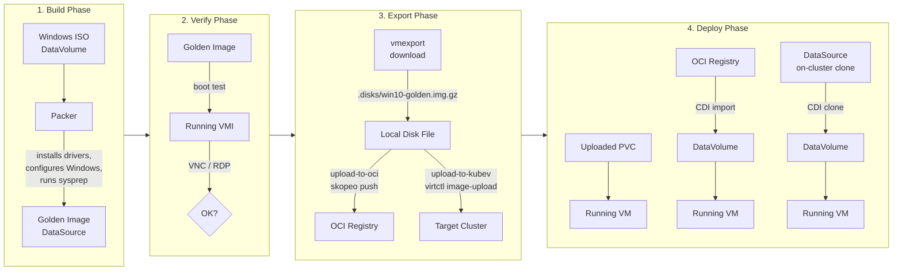

# Building Windows 10 Golden Images with Packer on KubeVirt

This guide walks through building a Windows 10 golden image using [HashiCorp Packer](https://github.com/hashicorp/packer-plugin-kubevirt) on KubeVirt, then exporting it so it can be deployed on any KubeVirt cluster.

Further reading: [Building VM Golden Images with Packer (kubevirt.io)](https://kubevirt.io/2025/Building-VM-golden-image-with-Packer.html)

## Overview



The process has four phases:

| Phase      | What happens                                                                                                                                                                                 | Key tools                                            |
|------------|----------------------------------------------------------------------------------------------------------------------------------------------------------------------------------------------|------------------------------------------------------|
| **Build**  | Packer creates a VM from a Windows ISO, runs unattended install with drivers, configures the OS, then syspreps and shuts down. The result is a golden image DataSource on the build cluster. | `packer`, `virtctl`, `kubectl`                       |
| **Verify** | The golden image is booted to confirm it works. Connect via VNC or RDP to check the desktop, networking, and IIS demo page.                                                                  | `virtctl vnc`, RDP client                            |
| **Export** | The golden image is downloaded from the build cluster. Then it can be pushed to an OCI registry (`upload-to-oci`) or uploaded directly to another KubeVirt cluster (`upload-to-kubev`).      | `virtctl vmexport`, `skopeo`, `virtctl image-upload` |
| **Deploy** | A VM is created by cloning the on-cluster DataSource, importing from the OCI registry, or using a directly uploaded PVC. CDI handles decompression automatically.                            | `kubectl`, CDI                                       |

## Prerequisites

- A KubeVirt cluster with CDI installed
- CLI tools: `kubectl`, `virtctl`, `packer`, `skopeo`, `jq`, `curl`
- A Windows 10 ISO (uploaded as a DataVolume)
- Instance type `u1.large` and preference `windows.10.virtio` available on the cluster

### Cluster prerequisites: Longhorn storage

KubeVirt VM disks — including the **golden image** — must be **Block** volumes on a
storage class that supports RWX+Block (`kubev-vms`: Longhorn with `migratable: "true"`).
The golden must be Block because deploys clone it into a Block VM disk, and only a
**Block→Block** clone is a raw `dd` copy. A **Filesystem** golden instead forces a
host-assisted clone whose non-root source pod runs `du` and dies on the root-owned
`lost+found` (`Permission denied`), so the clone hangs forever. `upload-to-kubev.sh`
(and `image-export/vm-from-registry-image.yaml`) create Block volumes accordingly.

On a Longhorn cluster with **fewer nodes than the storage class's replica count**
(`kubev-vms` uses `numberOfReplicas: 3`, but the demo cluster has 2 nodes), new CDI
volumes (clone targets, import scratch, upload targets) fail to schedule with
`ReplicaSchedulingFailure` / "insufficient storage" until Longhorn is tuned once,
cluster-wide:

```bash
# allow >1 replica per node (3 replicas on 2 nodes)
kubectl -n longhorn-system patch settings.longhorn.io replica-soft-anti-affinity \
  --type merge -p '{"value":"true"}'
# thin VM disks: reservation >> real usage, so raise the provisioning cap
kubectl -n longhorn-system patch settings.longhorn.io storage-over-provisioning-percentage \
  --type merge -p '{"value":"200"}'
```

For the demo cluster these are version-controlled in the `demo-envs` repo at
`kubev/manifests/longhorn-settings.yaml` (applied alongside `storageclasses.yaml`).

## Directory Structure

```
packer/windows-10/
├── Justfile                    # All recipes organized by phase (run: just --list)
├── windows-10.pkr.hcl          # Packer template
├── iso-datavolume.yaml          # Windows ISO DataVolume definition
├── autounattend.xml             # Unattended Windows install answers
├── unattend-oobe.xml            # OOBE/sysprep answer file
├── scripts/
│   ├── install-drivers.ps1      # VirtIO driver installation
│   ├── set-network.ps1          # Network configuration
│   ├── enable-winrm.ps1         # Enable WinRM for Packer provisioning
│   ├── setup-iis.ps1            # IIS + demo web page
│   └── configure-golden-image.ps1  # RDP, privacy, regional settings
├── vm-from-golden-image.yaml    # Deploy VM by cloning on-cluster DataSource (namespace placeholders)
├── verify-rdp-service.yaml      # RDP service for verification
├── image-export/
│   ├── download-golden-image.sh # Download golden image from build cluster
│   ├── upload-to-oci.sh         # Push disk image to OCI container registry
│   ├── upload-to-kubev.sh       # Upload disk image directly to a KubeVirt cluster
│   ├── vm-from-registry-image.yaml # Deploy VM from OCI registry image
│   └── vm-from-upload.yaml      # Deploy VM from directly uploaded PVC
├── generated/                   # Generated manifests
└── .disks/                      # Downloaded disk images (git-ignored)
```

## Quick Start

### Phase 1: Build the Golden Image

```bash
cd packer/windows-10

# Full pipeline: upload ISO, wait, init packer, check prerequisites, build
just all
```

Or step by step:

```bash
just setup          # Create namespace + ISO DataVolume
just iso-wait       # Wait for ISO download to complete
just init           # Initialize Packer plugins
just check-prereqs  # Verify instance type, preference, ISO exist
just build          # Run the Packer build (~45 min)
```

**What Packer does:**
1. Creates a VM with the Windows ISO attached
2. `autounattend.xml` drives unattended installation with VirtIO drivers
3. PowerShell scripts configure networking, WinRM, IIS, RDP, and regional settings
4. `sysprep /generalize` prepares the image for cloning (new SID on each clone)
5. Packer snapshots the disk as a golden image DataSource

**Default credentials:**

| Phase | User | Password | Configured in |
|-------|------|----------|---------------|
| During build (WinRM/Packer) | `admin` | `admin` | `autounattend.xml`, `windows-10.pkr.hcl` |
| After sysprep (cloned VMs) | `root` | `toor` | `unattend-oobe.xml` |

The build user `admin` is created by `autounattend.xml` for Packer's WinRM provisioning. After sysprep, cloned VMs boot with the `root`/`toor` account configured in `unattend-oobe.xml` (auto-login enabled).

### Phase 2: Verify the Golden Image

```bash
just verify       # Boot the golden image and expose RDP
just vnc          # Connect via VNC
just verify-stop  # Shut down after testing
```

### Phase 3: Export the Golden Image

Download the golden image from the build cluster:

```bash
export SRC_KUBECONFIG=/path/to/build-cluster-kubeconfig
just image-download   # Downloads to .disks/win10-golden.img.gz
```

The download script handles clusters without external export links by falling back to `kubectl port-forward`.

Then choose how to transfer it:

**Option A: Push to OCI container registry**

```bash
# Login first
skopeo login quay.io

# Push to registry (uses skopeo, no local Docker/podman build needed)
just upload-to-oci
```

**Option B: Upload directly to a KubeVirt cluster** (recommended)

```bash
# Upload the disk file straight to the target cluster via virtctl
export DST_KUBECONFIG=/path/to/target-cluster-kubeconfig
just upload-to-kubev
```

`virtctl image-upload` pushes the disk straight to CDI's upload proxy — faster than the OCI
route and works when the target cluster can't pull from a registry (air-gapped /
network-restricted). The script sets up a `kubectl port-forward` automatically if the proxy
isn't externally exposed.

It creates, in namespace `win10-golden`:

- a **Block** DataVolume/PVC `windows-10-golden` on the `kubev-vms` StorageClass, and
- a DataSource `windows-10-golden` pointing at it.

**Block mode is mandatory** — see [Cluster prerequisites: Longhorn storage](#cluster-prerequisites-longhorn-storage)
for why (a Filesystem golden makes every clone hang on `lost+found`). Override the defaults
with env vars: `TARGET_NS` (`win10-golden`), `DISK_SIZE` (`50Gi`),
`TARGET_STORAGE_CLASS` (`kubev-vms`), `VOLUME_MODE` (`block`), `ACCESS_MODE` (`ReadWriteMany`).

From here, deploy VMs either by **cloning** this DataSource — Phase 4 Option A with
`just --set build_namespace win10-golden deploy <ns>` — or by booting the uploaded disk
**directly** (Phase 4 Option C).

### Phase 4: Deploy VMs

**Option A: Clone from on-cluster DataSource** (same cluster as the build):

```bash
just deploy my-win10-vm
```

> The clone source namespace is the Justfile `build_namespace` variable (default
> `build-vm-win10`, matching the Packer build). If the golden was created via
> `upload-to-kubev.sh` (namespace `win10-golden`), point the deploy at it:
> `just --set build_namespace win10-golden deploy my-win10-vm`.

**Option B: Import from OCI registry** (any cluster with registry access):

```bash
export KUBECONFIG=/path/to/target-cluster-kubeconfig
just deploy-registry my-win10-vm
```

This creates a DataVolume that pulls from the OCI registry. CDI auto-detects and decompresses the gzip image. Note that CDI requires scratch space equal to the DataVolume size during registry imports (~100Gi total temporarily for a 50Gi disk).

**Option C: Deploy after direct upload** (used after `upload-to-kubev`):

```bash
export DST_KUBECONFIG=/path/to/target-cluster-kubeconfig
just deploy-upload
```

### Manage Deployed VMs

```bash
just deploy-status my-win10-vm   # Show VM, DataVolume, Pod status
just deploy-vnc my-win10-vm      # Open VNC console
just deploy-destroy my-win10-vm  # Delete the VM and namespace
```

## Justfile Recipes

Run `just` (or `just --list`) to see all recipes grouped by phase. The deploy recipes
(`deploy`, `generate`, `deploy-status`, `deploy-vnc`, `deploy-destroy`, `deploy-registry`)
take the target namespace as a **required** argument, e.g. `just deploy my-win10-vm`.

The deployment manifest `vm-from-golden-image.yaml` is namespace-agnostic via two
placeholder tokens that the Justfile substitutes with `sed`:

- `__TODO_NAMESPACE__` — the runtime namespace to deploy into (the required recipe argument).
- `__TODO_BUILD_NAMESPACE__` — the namespace holding the golden image (the `build_namespace` variable).

## Configuration

**Justfile variables** — override per invocation with `just --set <name> <value> <recipe>`,
or edit the defaults in the `Justfile`:

| Variable          | Default                                                  | Description                                                        |
|-------------------|----------------------------------------------------------|--------------------------------------------------------------------|
| `build_namespace` | `build-vm-win10`                                         | Build/source namespace; fills `__TODO_BUILD_NAMESPACE__` on deploy |
| `golden_vm_name`  | `windows-10-golden`                                      | Golden image VM + DataSource name                                  |
| `demo_vm_name`    | `win10-demo`                                             | Fixed name of the deployed VM/Service                              |
| `timeout`         | `10m`                                                    | Wait timeout for DataVolume/VMI operations                         |
| `registry_image`  | `quay.io/toschneck/kvirt-disks-windows-10-golden:latest` | Target OCI registry image                                          |
| `output_dir`      | `./generated`                                            | Where `just generate` writes rendered manifests                    |

The **runtime namespace is not a variable** — it is a required argument to the deploy
recipes (`just deploy <namespace>`, `just generate <namespace>`, …) and fills
`__TODO_NAMESPACE__`.

**Environment variables** — read by the `image-export/*.sh` scripts:

| Variable               | Default                          | Description                                             |
|------------------------|----------------------------------|---------------------------------------------------------|
| `SRC_KUBECONFIG`       | *(required for download)*        | Kubeconfig for the build cluster                        |
| `DST_KUBECONFIG`       | *(required for upload-to-kubev)* | Kubeconfig for the target cluster                       |
| `TARGET_NS`            | `win10-golden`                   | Namespace for the uploaded golden + DataSource          |
| `DISK_SIZE`            | `50Gi`                           | Size of the uploaded golden volume                      |
| `TARGET_STORAGE_CLASS` | `kubev-vms`                      | Storage class for the uploaded golden (RWX + Block)     |
| `VOLUME_MODE`          | `block`                          | Volume mode for the uploaded golden (**must** be Block) |
| `ACCESS_MODE`          | `ReadWriteMany`                  | PVC access mode for direct uploads                      |