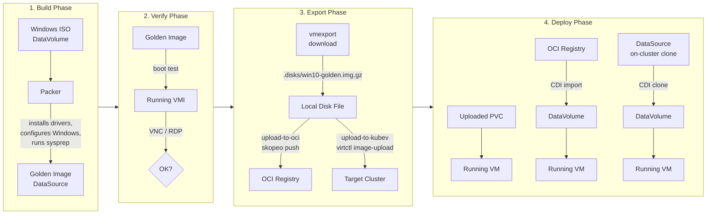

# Building Windows 10 Golden Images with Packer on KubeVirt

This guide walks through building a Windows 10 golden image using [HashiCorp Packer](https://github.com/hashicorp/packer-plugin-kubevirt) on KubeVirt, then exporting it so it can be deployed on any KubeVirt cluster.

Further reading: [Building VM Golden Images with Packer (kubevirt.io)](https://kubevirt.io/2025/Building-VM-golden-image-with-Packer.html)

## Overview



The process has four phases:

| Phase      | What happens                                                                                                                                                                                 | Key tools                                            |
|------------|----------------------------------------------------------------------------------------------------------------------------------------------------------------------------------------------|------------------------------------------------------|
| **Build**  | Packer creates a VM from a Windows ISO, runs unattended install with drivers, configures the OS, then syspreps and shuts down. The result is a golden image DataSource on the build cluster. | `packer`, `virtctl`, `kubectl`                       |
| **Verify** | The golden image is booted to confirm it works. Connect via VNC or RDP to check the desktop, networking, and IIS demo page.                                                                  | `virtctl vnc`, RDP client                            |
| **Export** | The golden image is downloaded from the build cluster. Then it can be pushed to an OCI registry (`upload-to-oci`) or uploaded directly to another KubeVirt cluster (`upload-to-kubev`).      | `virtctl vmexport`, `skopeo`, `virtctl image-upload` |
| **Deploy** | A VM is created by cloning the on-cluster DataSource, importing from the OCI registry, or using a directly uploaded PVC. CDI handles decompression automatically.                            | `kubectl`, CDI                                       |

## Prerequisites

- A KubeVirt cluster with CDI installed
- CLI tools: `kubectl`, `virtctl`, `packer`, `skopeo`, `jq`, `curl`
- A Windows 10 ISO (uploaded as a DataVolume)
- Instance type `u1.large` and preference `windows.10.virtio` available on the cluster

## Directory Structure

```
packer/windows-10/
├── Makefile                    # All targets organized by phase
├── windows-10.pkr.hcl          # Packer template
├── iso-datavolume.yaml          # Windows ISO DataVolume definition
├── autounattend.xml             # Unattended Windows install answers
├── unattend-oobe.xml            # OOBE/sysprep answer file
├── scripts/
│   ├── install-drivers.ps1      # VirtIO driver installation
│   ├── set-network.ps1          # Network configuration
│   ├── enable-winrm.ps1         # Enable WinRM for Packer provisioning
│   ├── setup-iis.ps1            # IIS + demo web page
│   └── configure-golden-image.ps1  # RDP, privacy, regional settings
├── vm-from-golden-image.yaml    # Deploy VM by cloning on-cluster DataSource
├── verify-rdp-service.yaml      # RDP service for verification
├── image-export/
│   ├── download-golden-image.sh # Download golden image from build cluster
│   ├── upload-to-oci.sh         # Push disk image to OCI container registry
│   ├── upload-to-kubev.sh       # Upload disk image directly to a KubeVirt cluster
│   ├── vm-from-registry-image.yaml # Deploy VM from OCI registry image
│   └── vm-from-upload.yaml      # Deploy VM from directly uploaded PVC
├── generated/                   # Generated manifests
└── .disks/                      # Downloaded disk images (git-ignored)
```

## Quick Start

### Phase 1: Build the Golden Image

```bash
cd packer/windows-10

# Full pipeline: upload ISO, wait, init packer, check prerequisites, build
make all
```

Or step by step:

```bash
make setup          # Create namespace + ISO DataVolume
make iso-wait       # Wait for ISO download to complete
make init           # Initialize Packer plugins
make check-prereqs  # Verify instance type, preference, ISO exist
make build          # Run the Packer build (~45 min)
```

**What Packer does:**
1. Creates a VM with the Windows ISO attached
2. `autounattend.xml` drives unattended installation with VirtIO drivers
3. PowerShell scripts configure networking, WinRM, IIS, RDP, and regional settings
4. `sysprep /generalize` prepares the image for cloning (new SID on each clone)
5. Packer snapshots the disk as a golden image DataSource

**Default credentials:**

| Phase | User | Password | Configured in |
|-------|------|----------|---------------|
| During build (WinRM/Packer) | `admin` | `admin` | `autounattend.xml`, `windows-10.pkr.hcl` |
| After sysprep (cloned VMs) | `root` | `toor` | `unattend-oobe.xml` |

The build user `admin` is created by `autounattend.xml` for Packer's WinRM provisioning. After sysprep, cloned VMs boot with the `root`/`toor` account configured in `unattend-oobe.xml` (auto-login enabled).

### Phase 2: Verify the Golden Image

```bash
make verify       # Boot the golden image and expose RDP
make vnc          # Connect via VNC
make verify-stop  # Shut down after testing
```

### Phase 3: Export the Golden Image

Download the golden image from the build cluster:

```bash
export SRC_KUBECONFIG=/path/to/build-cluster-kubeconfig
make image-download   # Downloads to .disks/win10-golden.img.gz
```

The download script handles clusters without external export links by falling back to `kubectl port-forward`.

Then choose how to transfer it:

**Option A: Push to OCI container registry**

```bash
# Login first
skopeo login quay.io

# Push to registry (uses skopeo, no local Docker/podman build needed)
make upload-to-oci
```

**Option B: Upload directly to a KubeVirt cluster**

```bash
# Upload the disk file straight to the target cluster via virtctl
export DST_KUBECONFIG=/path/to/target-cluster-kubeconfig
make upload-to-kubev
```

This uses `virtctl image-upload` to push the disk directly to CDI's upload proxy. Faster than the OCI route and works well when the target cluster can't pull from the registry (e.g. air-gapped or network-restricted environments).

### Phase 4: Deploy VMs

**Option A: Clone from on-cluster DataSource** (same cluster as the build):

```bash
make deploy DEMO_NS=my-win10-vm
```

**Option B: Import from OCI registry** (any cluster with registry access):

```bash
export KUBECONFIG=/path/to/target-cluster-kubeconfig
make deploy-registry
```

This creates a DataVolume that pulls from the OCI registry. CDI auto-detects and decompresses the gzip image. Note that CDI requires scratch space equal to the DataVolume size during registry imports (~100Gi total temporarily for a 50Gi disk).

**Option C: Deploy after direct upload** (used after `upload-to-kubev`):

```bash
export DST_KUBECONFIG=/path/to/target-cluster-kubeconfig
make deploy-upload
```

### Manage Deployed VMs

```bash
make deploy-status   # Show VM, DataVolume, Pod status
make deploy-vnc      # Open VNC console
make deploy-destroy  # Delete the VM and namespace
```

## Makefile Targets

Run `make help` to see all available targets grouped by phase.

## Environment Variables

| Variable               | Default                                                  | Description                            |
|------------------------|----------------------------------------------------------|----------------------------------------|
| `NAMESPACE`            | `build-vm-win10`                                         | Build namespace                        |
| `VM_NAME`              | `windows-10-golden`                                      | Golden image VM name                   |
| `DEMO_NS`              | `win10-golden`                                           | Namespace for deployed demo VMs        |
| `TIMEOUT`              | `10m`                                                    | Wait timeout for DataVolume operations |
| `SRC_KUBECONFIG`       | *(required for download)*                                | Kubeconfig for the build cluster       |
| `DST_KUBECONFIG`       | *(required for upload-to-kubev)*                         | Kubeconfig for the target cluster      |
| `REGISTRY_IMAGE`       | `quay.io/toschneck/kvirt-disks-windows-10-golden:latest` | Target OCI registry image              |
| `TARGET_STORAGE_CLASS` | *(cluster default)*                                      | Storage class on the target cluster    |
| `ACCESS_MODE`          | `ReadWriteMany`                                          | PVC access mode for direct uploads     |