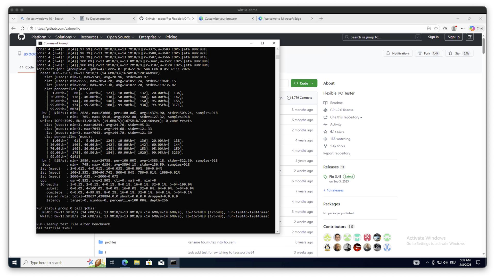

# FIO - (Basic) Storage Performance Testing Kubermatic Virtualization

### Steps

#### General Usage - Linux Workload
1. find out the device, for:
   1. [`pvc.test.blockdevice.yaml`](pvc.test.blockdevice.yaml) its: `/dev/xvda`
   ```bash
   KE_DEVICE=/dev/xvda
   ```
   2. [`pvc.test.file.yaml`](pvc.test.file.yaml) its: `/data`
   ```bash
   KE_DEVICE=/data/mounted-file-test
   ```
   3. local file at pod/vm [vm.test.attached-disk.ubuntu.yaml](vm.test.attached-disk.ubuntu.yaml): 
   ```bash
   KE_DEVICE=./local-file-test
   ```
   4. mounted block VM [vm.test.attached-disk.ubuntu.yaml](vm.test.attached-disk.ubuntu.yaml):
   ```bash
   KE_DEVICE=/dev/vdb
   ```

2. execute random read write fio test
```bash
echo "-------- TEST FILE/DEVICE: $KE_DEVICE ------"
fio \
  --filename=${KE_DEVICE} \
  --size=5GB \
  --direct=1 \
  --rw=randrw \
  --bs=4k \
  --ioengine=libaio \
  --iodepth=256 \
  --runtime=120 \
  --numjobs=4 \
  --time_based \
  --group_reporting \
  --name=iops-test-job \
  --eta-newline=1 \
  ;
```
*INFO:*
On Host find mounted device
1. `kubectl get pv -o yaml PV_NAME`, select `imageName: csi-vol-xxxx`
2. Find Device number `grep csi-vol-xxxx /sys/bus/rbd/devices/*/name`
3. device should be `ls -la /dev/rbd` + Number of step ahead

#### Usage - Windows Workload
Start your Windows VM as in the examples of the repo and modify the device to your target system values:
```bash
kubectl explain vm.spec.template.spec.domain.devices.disks.disk.bus
```
```
GROUP:      kubevirt.io
KIND:       VirtualMachine
VERSION:    v1

FIELD: bus <string>


DESCRIPTION:
    Bus indicates the type of disk device to emulate.
    supported values: virtio, sata, scsi, usb.
```
```yaml
        # --- Devices ---
        devices:
          disks:
            # OS Disk (using virtio is recommended for performance)
            - name: osdisk
              disk:
                #bus: virtio not working for windows 10
                bus: scsi
                #bus: sata
              bootOrder: 1
```
Install the fio testing Tool:
- Download MSI installer from https://github.com/axboe/fio/releases

Execute the [fio-test-windows.cmd](fio-test-windows.cmd) command in the CMD.
It should then look Similar as 


## Results - Kubermatic Environments

**IMPORTANT: The results not resilient to every situation and system and just a snapshot view!!**

### Reference System on Google Cloud - GCP Rook Ceph
- GCP Compute Type: `n2-standard-8`
- Setup: hyperconverged
- Storage: Dedicated Data Disks `pd-ssd` with rook ceph
- No dedicated storage network

Date: `2026-02-04 ++`

| Infra | Env   | Level                                                 | Storage                         | Read      | R IOps | Write     | W IOps | Note |
|-------|-------|-------------------------------------------------------|---------------------------------|-----------|--------|-----------|--------|------|
| gcp   | kubev | pod,  mounted block                                   | rook ceph, replica 3, kubev-vms | 37.6MiB/s | 9629   | 37.6MiB/s | 9629   |      |
|       |       |                                                       |                                 |           |        |           |        |      |
| gcp   | kubev | Ubuntu VM with guest utils, mounted block             | ceph, replica 3, kubev-vms      | 38.1MiB/s | 9749   | 38.1MiB/s | 9749   |      |
|       |       |                                                       |                                 |           |        |           |        |      |
| gcp   | kubev | Windows VM with guest utils, no device bus configured | ceph, replica 3, kubev-vms      | 13.9MiB/s | 3567   | 13.9MiB/s | 3569   |      |
| gcp   | kubev | Windows VM with guest utils, bus `scsi`               | ceph, replica 3, kubev-vms      | 38.9MiB/s | 9964   | 38.9MiB/s | 9971   |      |
| gcp   | kubev | Windows VM with guest utils, bus `sata`               | ceph, replica 3, kubev-main     | 5.6MiB/s  | 1415   | 5.6MiB/s  | 1415   |      |


### FOG System - Ceph Cluster
- 3 Bare Metal DELL Hosts
- Setup: hyperconverged
- Storage: Dedicated Data Disks with SDD and non k8s-based Ceph
- Dedicated storage network

Date: `2026-02-02`

| Infra    | Env              | Level                              | Storage                     | Read     | R IOps | Write    | W IOps | Note |
|----------|------------------|------------------------------------|-----------------------------|----------|--------|----------|--------|------|
| fog-bcp1 | bare-metal kubev | pod, file                          | local host storage          | 418MiB/s | 107k   | 424MiB/s | 108k   |      |
|          |                  |                                    |                             |          |        |          |        |      |
| fog-bcp1 | bare-metal kubev | pod, mounted block                 | ceph, replica 3, kubev-main | 358MiB/s | 91.7k  | 358MiB/s | 91.6k  |      |
| fog-bcp1 | bare-metal kubev | pod, mounted file                  | ceph, replica 3, kubev-main | 347MiB/s | 88.7k  | 346MiB/s | 88.7k  |      |
| fog-bcp1 | bare-metal kubev | VM without guest utils, file       | ceph, replica 3, kubev-main | 143MiB/s | 36.7k  | 143MiB/s | 36.6k  |      |
| fog-bcp1 | bare-metal kubev | VM with guest utils, mounted block | ceph, replica 3, kubev-main | 143MiB/s | 36.7k  | 143MiB/s | 36.6k  |      |
| fog-bcp1 | bare-metal kubev | VM with guest utils, file          | ceph, replica 3, kubev-main | 143MiB/s | 36.7k  | 143MiB/s | 36.6k  |      |
|          |                  |                                    |                             |          |        |          |        |      |
| fog-bcp1 | bare-metal kubev | pod, mounted block                 | ceph, replica 3, kubev-vms  | 440MiB/s | 113k   | 440MiB/s | 113k   |      |
| fog-bcp1 | bare-metal kubev | pod, mounted file                  | ceph, replica 3, kubev-vms  | 177MiB/s | 45.3k  | 177MiB/s | 45.2k  |      |
| fog-bcp1 | bare-metal kubev | VM with guest utils, mounted block | ceph, replica 3, kubev-vms  | 160MiB/s | 41.0k  | 160MiB/s | 41.0k  |      |
| fog-bcp1 | bare-metal kubev | VM with guest utils, file          | ceph, replica 3, kubev-vms  | 171MiB/s | 43.7k  | 170MiB/s | 43.6k  |      |


### DC Seed PROD - Dell PowerFlex
Date: `2026-02-02`

- ~10 Bare Metal DELL Hosts
- Setup: attached Storage
- Storage: Dedicated Data storage based on Dell PowerFlex
- Dedicated storage network

| Infra   | Env              | Level                              | Storage                                  | Read     | R IOps | Write    | W IOps | Note |
|---------|------------------|------------------------------------|------------------------------------------|----------|--------|----------|--------|------|
| dc-prod | bare-metal kubev | pod, mounted block                 | vxflexos, replica ?                      | 748MiB/s | 192k   | 748MiB/s | 192k   |      |
| dc-prod | bare-metal kubev | pod, file                          | local host storage                       | 637MiB/s | 163k   | 637MiB/s | 163k   |      |
| dc-prod | bare-metal kubev | pod, mounted file                  | vxflexos, mounted file storage, replica? | 670MiB/s | 171k   | 670MiB/s | 171k   |      |
| dc-prod | bare-metal kubev | VM with guest utils, mounted block | vxflexos, replica ?                      | 273MiB/s | 70.0k  | 273MiB/s | 70.0k  |      |
| dc-prod | bare-metal kubev | VM with guest utils, file          | vxflexos, replica ?                      | 272MiB/s | 69.8k  | 272MiB/s | 69.8k  |      |

