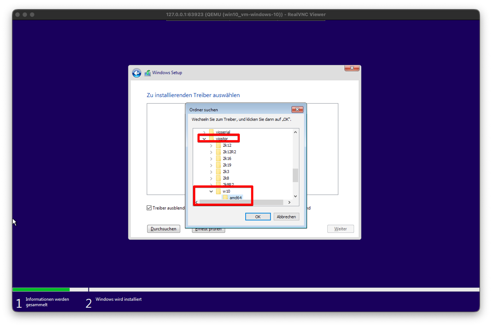
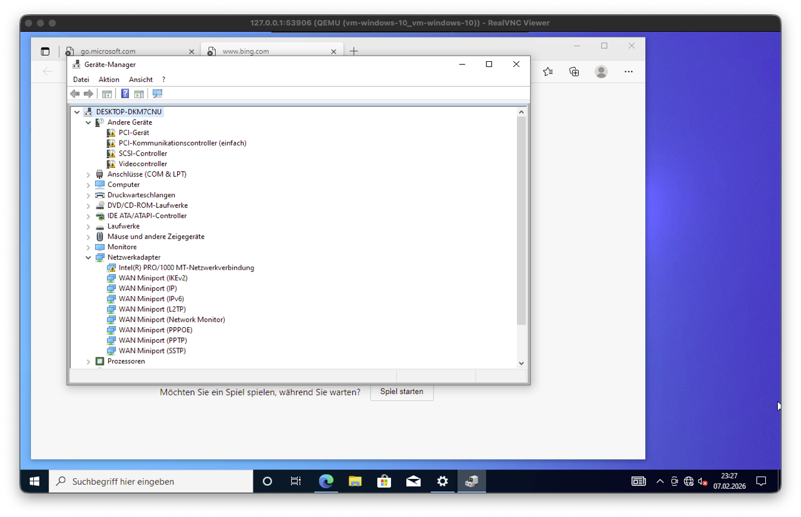
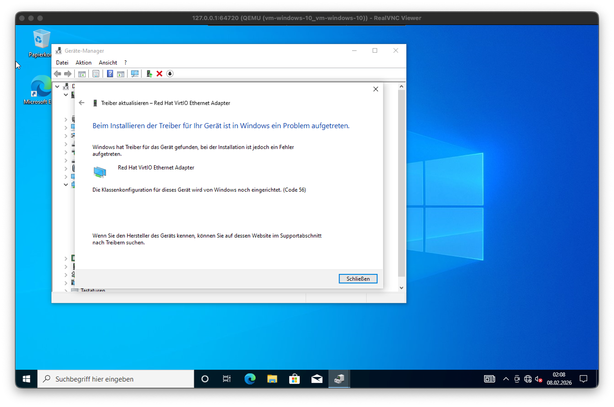
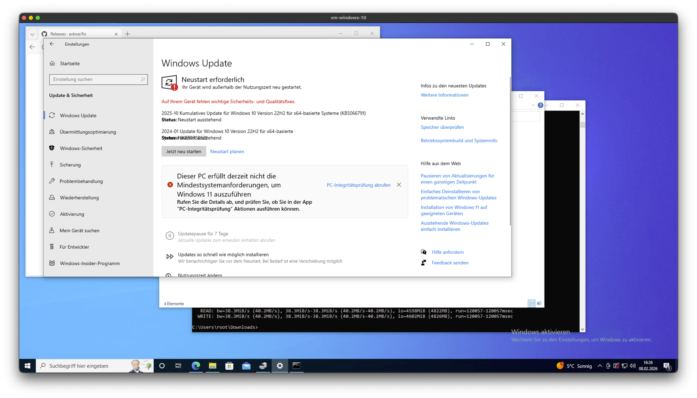

upload via kubectl cp to the [registry server](../hack/vm-image-registry.yaml)
check images 
k exec -n kube-system vm-image-registry-79bbbf66c-5zfxk -- ls -lah /usr/share/nginx/html/vms/

specify right image name in yaml

start vnc session 

select disk driver

details
https://kubevirt.io/user-guide/user_workloads/windows_virtio_drivers/


Iso Download
- https://visualstudio.microsoft.com/subscriptions/

storage device setting
- sata during boot (without virtio guest driver no other works) 
- scsi works after reboot (and installed driver)
- virtio didn't worked at all, hanging boot screen [win-error-bootscreen.png](.assets/win-error-bootscreen.png)
- kubevirt driver image is crucial, need to match to kubevirt verison (at least I asume it from my test)
  ```yaml
        - containerDisk:
          image: quay.io/kubevirt/virtio-container-disk:v1.5.3
  ```

network driver issue
```yaml
          interfaces:
          - name: default
            masquerade: { }
            model: e1000
```
didn't worked out of the box,
best chance is
```yaml
          interfaces:
          - name: default
            masquerade: { }
            # no model spec
```
After win10 started, open windows Device Manger via `mmc devmgmt.msc`


driver installation issue could happen, then "remove/uninstall" the network device and reinstall it e.g.


Setup Remote Desktop in VM so it is accessible via RDP


snapshot example windows update
