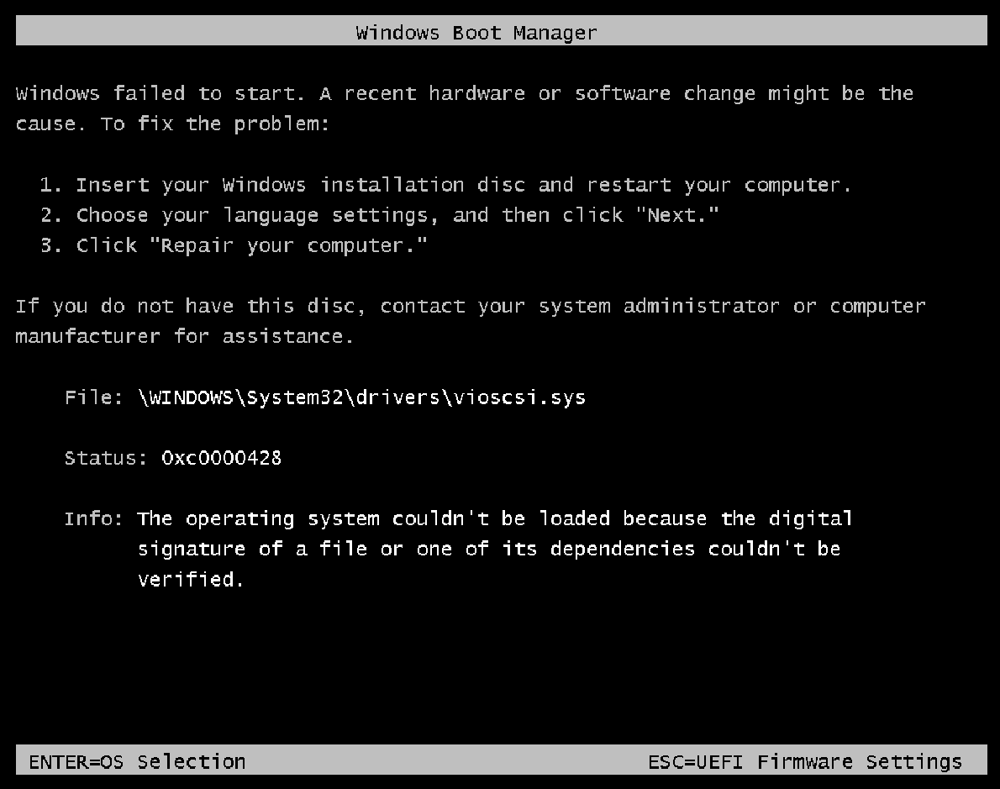

# Windows Server 2025 on KubeVirt

> You can get your Windows Server 2025 Evaluation ISO here: <https://www.microsoft.com/de-de/evalcenter/download-windows-server-2025>

## Prerequisites Image Upload

### Uploading directly to a DataVolume

1. Download the Windows ISO from Microsoft website.
2. Create a DataVolume as a target for the upload:

    ```yaml
    apiVersion: cdi.kubevirt.io/v1beta1
    kind: DataVolume
    metadata:
    name: winserver-25
    namespace: default
    annotations:
        cdi.kubevirt.io/storage.bind.immediate.requested: ""
    spec:
    source:
        upload: {}
    pvc:
        accessModes:
        - ReadWriteMany
        resources:
        requests:
            storage: 10Gi
        storageClassName: kubev-main
    ```

3. Apply the DataVolume manifest:

    ```bash
    kubectl apply -f datavolume.yaml
    ```

4. Upload the ISO using `virtctl`:

    ```bash
    virtctl image-upload dv winserver-25 \
       --namespace=default \
       --image-path=".\26100.32230.260111-0550.lt_release_svc_refresh_SERVER_EVAL_x64FRE_en-us.iso" \
       --size="10Gi" \
       --insecure \
       --uploadproxy-url=https://127.0.0.1:8443
    ```

## Installation

1. Create the VM object

    ```bash
    kubectl apply -f kubevirt.new.vm.minimal.winserver2025.yaml
    ```

2. Wait for the VM to be running
3. Open the KVM-Console via VNC and connect to it using your favorite VNC-Client

    ```bash
    virtctl vnc vm-win-server-2025 -n default --proxy-only
    ```

4. Press any key to enter the "BIOS" and use the boot manager to boot from the install CD (the DataVolume we uploaded the ISO to)
5. Follow the installation steps of the Windows Server 2025 installer (We recommend the "Desktop Experience" version for easier access during tests)

## Configuration

### RDP

1. Open Server Manager
2. Switch to "Local Server"
3. Click on the "Disabled" next to "Remote Desktop"
4. Select "Allow remote connections to this computer" and confirm the warning about the firewall rules
5. Apply the changes and close the dialog

### Active Directory

1. Open Server Manager
2. Switch to "Local Server"
3. On the top right click on "Manage" and select "Add Roles and Features"
4. Continue with "Next" until you reach the "Server Roles" section
5. Select "Active Directory Domain Services" and confirm the popup to add the required features
6. Continue with "Next" until you reach the "Confirmation" section and click on "Install"
7. After the installation is complete, your server manager now includes the "AD DS" section.
8. Click on the flag on the top right and select "Promote this server to a domain controller" to continue with the configuration of your Active Directory

## What works (or did not)

- Installing the VirtIO SCSI Drivers resulted in a signature verification error during the next boot, completely breaking booting the VM
  

