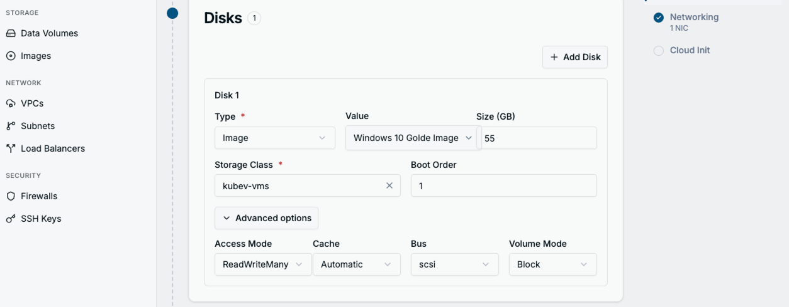
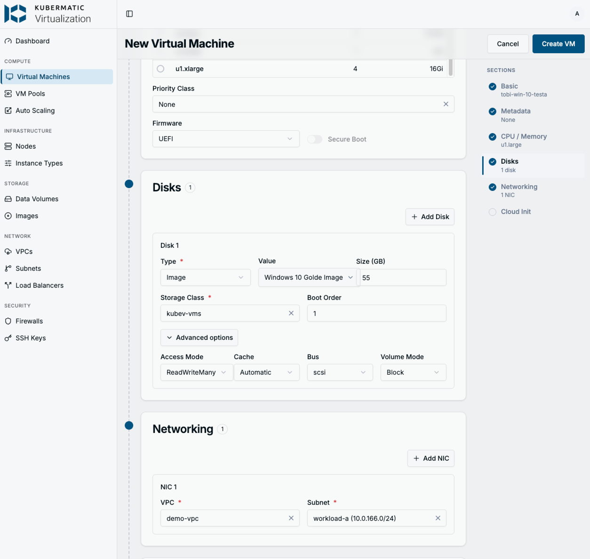

# Creating a Demo Windows 10 VM via the Kubermatic Virtualization UI

Step-by-step guide for creating a working **Windows 10** demo VM through the
**Kubermatic Virtualization** dashboard at
<http://kubev.dc.k8c.io:8080/virtual-machines/create>.

This is the Windows counterpart to [../linux/kubev-demo-vm-UI.md](../linux/kubev-demo-vm-UI.md)
(Ubuntu). The Windows disk comes from the **golden image** (built with Packer — see
[`../packer/README.md`](../packer/README.md)), which is published in the dashboard as an
**Image** object named **`Windows 10 Golde Image`** (Storage → Images), backed by the
`win10-golden` Block PVC.

> [!IMPORTANT]
> **The three things that break Windows UI VMs on this cluster:**
>
> 1. **Instance type** — pick a **`u1.*` (Universal)** or `o1.*` type, at least
>    **`u1.large`** (2 vCPU / 8 GiB). Do **not** pick `cx1.*`, `m1.*`, `n1.*` or
>    `rt1.*` — they need dedicated CPUs (`cpumanager=true`) and/or huge pages the
>    demo worker nodes don't have, so the VM never schedules (`ErrorUnschedulable`).
> 2. **Storage Class + Volume Mode** — pick **`kubev-vms`** and **`Block`**. Not
>    `longhorn`, not `Filesystem`: the golden is a Block image, and a Filesystem
>    target makes the CDI clone hang.
> 3. **Firmware + Bus** — set Firmware to **`UEFI`** (Secure Boot off) and the disk
>    **Bus** to **`scsi`**. Windows needs UEFI, and the golden was built for the
>    VirtIO/SCSI bus. (These are what the `windows.10.virtio` preference sets on the
>    CLI path.)

---

## Quick reference: which instance type can I use?

The demo worker nodes (`kubev-demo-env-wk-1/2`) are plain nodes: `cpumanager=false`
and `hugepages-2Mi = 0`. Any instance type that requires dedicated CPU placement or
huge pages can never be scheduled.

| Family   | Class             | Dedicated CPU | Huge pages | Works on demo cluster                 |
|----------|-------------------|---------------|------------|---------------------------------------|
| **`u1`** | Universal         | no            | no         | ✅ **use `u1.large`+**                |
| **`o1`** | Overcommitted     | no            | no         | ✅ yes                                |
| `cx1`    | Compute Exclusive | yes           | 2Mi        | ❌ unschedulable                      |
| `m1`     | Memory Intensive  | no            | 2Mi        | ❌ unschedulable (huge pages)         |
| `n1`     | Network / DPDK    | yes           | 1Gi        | ❌ unschedulable (+ needs DPDK nodes) |
| `rt1`    | Real Time         | yes           | yes        | ❌ unschedulable                      |

Windows 10 wants **≥ 2 vCPU / 8 GiB**, so **`u1.large`** is the right default.

---

## Steps

Open **Virtual Machines** in the left nav → **+ New VM** (top right), then walk the
sections top-to-bottom.

### 1. Basic

- **Name:** `demo-win10-vm`
- **Node:** leave on **Auto-select** — do not pin a node.
- **Run Strategy:** `Always`

### 2. CPU / Memory + Firmware

The **VM Type** list is sorted alphabetically, so `cx1.*` (Compute Exclusive) sits at
the top — **that is the trap**. Search for and select **`u1.large`** instead.

- **VM Type:** `u1.large` (2 vCPU / 8 GiB)
- **Firmware:** `UEFI`, **Secure Boot off**

### 3. Disks — the golden image, Block on kubev-vms

Configure Disk 1:

- **Type:** `Image`
- **Value:** **`Windows 10 Golde Image`** (the published golden)
- **Size (GB):** `55` (≥ the 50 GiB golden)
- **Storage Class:** **`kubev-vms`**
- **Boot Order:** `1`
- **Advanced options:**
  - **Access Mode:** `ReadWriteMany`
  - **Cache:** `Automatic`
  - **Bus:** `scsi`
  - **Volume Mode:** `Block`

### 4. Networking

- **VPC:** `demo-vpc`
- **Subnet:** `workload-a (10.0.166.0/24)`

### 5. Cloud Init — **leave OFF**

Windows does **not** use cloud-init. The login is baked into the golden image by
sysprep, so **skip Cloud Init**. On first boot the clone runs the sysprep OOBE pass
(new SID) and auto-logs in as:

| User   | Password |
| ------ | -------- |
| `root` | `toor`   |

### 6. Create

The completed form should look like this (`u1.large`, UEFI, the `Windows 10 Golde
Image` on `kubev-vms` / Block / scsi, `demo-vpc` / `workload-a`):

Click **Create VM**. The VM goes `Provisioning` (CDI clones the golden into a
`kubev-vms` Block disk) → `Starting` → `Running`, then Windows runs its **first-boot
sysprep** (a few minutes, usually one reboot) before the desktop and RDP are ready.

---

## Access the VM

- **Dashboard:** open the VM's detail page → **Console / VNC** (auto-login `root` / `toor`).
- **CLI (VNC):** `virtctl -n kubermatic-virtualization vnc demo-win10-vm`
- **RDP:** the golden exposes 3389. If a LoadBalancer/`Service` has a free MetalLB IP,
  RDP to that; otherwise port-forward:
  `kubectl -n kubermatic-virtualization port-forward svc/demo-win10-vm 3389:3389`
  then RDP to `localhost:3389` (`root` / `toor`).

---

## Troubleshooting

- **VM stuck in `ErrorUnschedulable`** — a `cx1.*`/`m1/n1/rt1` instance type. The disk
  clones fine but the launcher pod can never be placed. Delete and recreate with
  `u1.large` (a stuck VM can't switch type in place). See the
  [Ubuntu guide](../linux/kubev-demo-vm-UI.md#troubleshooting-vm-stuck-in-errorunschedulable)
  for the exact diagnostics.
- **Stuck in `Provisioning` / clone never finishes** — the disk landed on `longhorn` /
  `Filesystem` instead of `kubev-vms` / `Block`, or Longhorn couldn't schedule the new
  volume. Recreate the disk as `kubev-vms` + `Block`; for the cluster-side Longhorn
  tuning see [`../packer/README.md`](../packer/README.md) → "Cluster prerequisites".
- **RDP LoadBalancer stuck `<pending>`** — MetalLB's pool is exhausted (many demo
  Services share it). Use `kubectl port-forward` or the dashboard VNC meanwhile.
